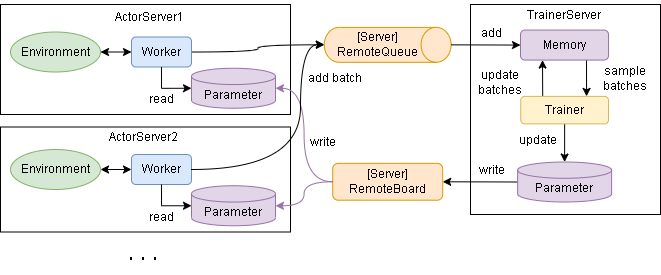

[](https://github.com/pocokhc/simple_distributed_rl/releases/latest)

# Simple Distributed Reinforcement Learning FrameWork (SRL)

I am creating a simple distributed reinforcement learning framework.

It has the following features:

+ Support for distributed reinforcement learning
+ Automatic adjustment of the interface between the environment and the algorithm
+ Support for Gym/Gymnasium environments
+ Provides customizable environment classes
+ Provides customizable reinforcement learning algorithm classes
+ Provides well-known reinforcement learning algorithms
+ (Support for new algorithms)

**Document**

<https://pocokhc.github.io/simple_distributed_rl/>


**Algorithm explanation article (Qiita)**

The article will be explained in Japanese.

<https://qiita.com/pocokhc/items/a2f1ba993c79fdbd4b4d>

# 1. Install
## 1-2.Related libraries

**Required library**

``` bash
pip install numpy
```

**Option Libraries**

Depending on the functions you use, the following libraries are required.

+ If you use an algorithm that requires Tensorflow
  + tensorflow
  + tensorflow-probability
+ If you are using an algorithm that requires Torch
  + <https://pytorch.org/get-started/locally/>
+ When using image-related functions
  + pillow
  + opencv-python
  + pygame
+ When using history statistics
  + pandas
  + matplotlib
+ When using the OpenAI Gym environment
  + gym or gymnasium
  + pygame
+ To view hardware statistics
  + psutil
  + pynvml
+ When using cloud/network distributed learning
  + redis
  + pika
  + paho-mqtt
+ To manage your learning
  + mlflow

The bulk installation command is as follows.
（Excluding Tensorflow, Torch, cloud distributed learning libraries, and MLFlow）

``` bash
pip install matplotlib pillow opencv-python pygame pandas gymnasium psutil pynvml
```

## 1-2.Install/Download

This framework can be installed or downloaded from GitHub.

**Install**

``` bash
pip install git+https://github.com/pocokhc/simple_distributed_rl
```

or

``` bash
git clone https://github.com/pocokhc/simple_distributed_rl.git
cd simple_distributed_rl
pip install .
```

**Download**

If the execution path is set to the srl directory, you can simply download it.

``` bash
# Download SRL files
git clone https://github.com/pocokhc/simple_distributed_rl.git
```

``` python
# SRL import example
import os
import sys

assert os.path.isdir("./simple_distributed_rl/srl/")  # Where to download SRL
sys.path.insert(0, "./simple_distributed_rl/")

import srl
print(srl.__version__)
```


# 2. Usage

Here's a simple usage example.

``` python
import srl
from srl.algorithms import ql  # Importing ql algorithms


def main():
    # Creating a runner
    runner = srl.Runner("Grid", ql.Config())

    # train
    runner.train(timeout=10)

    # Evaluation of training results
    rewards = runner.evaluate()
    print(f"evaluate episodes: {rewards}")

    # --- Visualization example
    #  ("pip install opencv-python pillow pygame" is required to run animation_save_gif)
    runner.animation_save_gif("Grid.gif")


if __name__ == "__main__":
    main()

```


For other usage, please see the following documentation.

+ [How To Use](https://pocokhc.github.io/simple_distributed_rl/pages/howtouse.html)


**(Trial implementation) Learning management using MLFlow**

There is an example in "examples/sample_mlflow.py".


# 3. Framework Overview

+ Sequence flow


+ Distributed flow



+ Simplified pseudo code(train)

``` python
# Initializing phase
env.setup()
worker.on_start()

# 1 episode initializing phase
env.reset()
worker.on_reset()

# 1 episode loop
while not env.done:
    action = worker.policy()  # parameter reference
    env.step(action)
    worker.on_step()

    # Train phase
    trainer.train()  # parameter update
```

+ Simplified pseudo code(not train)

``` python
# Initializing phase
env.setup()
worker.on_start()

# 1 episode initializing phase
env.reset()
worker.on_reset()

# 1 episode loop
while not env.done:
    env.render()
    action = worker.policy()  # parameter reference
    worker.render()
    env.step(action)
    worker.on_step()
env.render()
worker.render()
```


# 4. Custom environment and algorithms

Please refer to the following documents for creating original environments and algorithms.  
(The contents are in Japanese)

+ [Make Original Environment](https://pocokhc.github.io/simple_distributed_rl/pages/custom_env.html)
+ [Make Original Algorithm](https://pocokhc.github.io/simple_distributed_rl/pages/custom_algorithm.html)


# 5. Algorithms

## ModelFree

### ValueBase

|Algorithm |Observation|Action  |Tensorflow|Torch|ProgressRate||
|----------|-----------|--------|----------|-----|------------|---|
|QL        |Discrete   |Discrete|-         |- |100%|Basic Q Learning|
|DQN       |Continuous |Discrete|✔        |✔|100%||
|C51       |Continuous |Discrete|✔        |- |99%|CategoricalDQN|
|Rainbow   |Continuous |Discrete|✔        |✔|100%||
|R2D2      |Continuous |Discrete|✔        |- |100%||
|Agent57   |Continuous |Discrete|✔        |✔|100%||
|SND       |Continuous |Discrete|✔        |-|100%||
|Go-Explore|Continuous |Discrete|✔        |- |100%|DQN base, R2D3 memory base|


### PolicyBase/ActorCritic

|Algorithm     |Observation|Action    |Tensorflow|Torch|ProgressRate||
|--------------|-----------|----------|----------|-----|---|---|
|VanillaPolicy |Discrete   |Both      |-         |-    |100%||
|A3C/A2C       |-          |-         |-         |-    |-   ||
|TRPO          |-          |-         |-         |-    |-   ||
|PPO           |Continuous |Both      |✔        |-    |100%||
|DDPG/TD3      |Continuous |Continuous|✔        |-    |100%||
|SAC           |Continuous |Both      |✔        |-    |100%||

## AlphaSeries

|Algorithm  |Observation|Action  |Tensorflow|Torch|ProgressRate||
|-----------|-----------|--------|----------|-----|---|---|
|MCTS       |Discrete   |Discrete|-         |-    |100%|MDP base|
|AlphaZero  |Image      |Discrete|✔        |-    |100%|MDP base|
|MuZero     |Image      |Discrete|✔        |-    |100%|MDP base|
|StochasticMuZero|Image |Discrete|✔        |-    |100%|MDP base|

## ModelBase

|Algorithm  |Observation|Action     |Framework|ProgressRate|
|-----------|-----------|-----------|---------|----|
|DynaQ      |Discrete   |Discrete   |-        |100%|

### WorldModels

|Algorithm  |Observation|Action     |Tensorflow|Torch|ProgressRate||
|-----------|-----------|-----------|----------|-----|---|---|
|WorldModels|Continuous |Discrete   |✔        |-    |100%||
|PlaNet     |Continuous |Discrete   |✔(+tensorflow-probability)|-|100%||
|Dreamer    |Continuous |Both       |-|-|merge DreamerV3|
|DreamerV2  |Continuous |Both       |-|-|merge DreamerV3|
|DreamerV3  |Continuous |Both       |✔(+tensorflow-probability)|-|100%||

## Offline

|Algorithm  |Observation|Action     |Framework|ProgressRate|
|-----------|-----------|-----------|----------|----|
|CQL        |Discrete   |Discrete   |          |  0%|

## Original

|Algorithm     |Observation|Action  |Type     |Tensorflow|Torch|ProgressRate||
|--------------|-----------|--------|---------|----------|-----|---|---|
|QL_agent57    |Discrete   |Discrete|ValueBase|-         |-    |80%|QL + Agent57|
|Agent57_light |Continuous |Discrete|ValueBase|✔        |✔   |100%|Agent57 - (LSTM,MultiStep)|
|SearchDynaQ   |Discrete   |Discrete|ModelBase|-         |-    |100%|original|
|SearchDynaQ_v2|Discrete   |Discrete|ModelBase|-         |-    |99%|original|


# 6. Online Distributed Learning

For information on distributed learning over a network, please refer to the following documents.
(The contents are in Japanese)

+ [Distributed Learning (Online)](https://pocokhc.github.io/simple_distributed_rl/pages/distributed.html)

For information on linking with cloud services, please refer to the Qiita article.
(The contents are in Japanese)

+ [Distributed Reinforcement Learning Using Cloud Services (Free Edition)](https://qiita.com/pocokhc/items/f7a32ee6c62cba54d6ab)
+ [Distributed Reinforcement Learning Using Cloud Services (Kubernetes)](https://qiita.com/pocokhc/items/56c930e1e401ce156141)
+ [Distributed Reinforcement Learning Using Cloud Services (GKE/Paid Edition)](https://qiita.com/pocokhc/items/e08aab0fe56566ab9407)


# 7. Development environment

Look "./dockers/"

+ PC1
  + windows11
  + CPUx1: Core i7-8700 3.2GHz
  + GPUx1: NVIDIA GeForce GTX 1060 3GB
  + memory 48GB
+ PC2
  + windows11
  + CPUx1: Core i9-12900 2.4GHz
  + GPUx1: NVIDIA GeForce RTX 3060 12GB
  + memory 32GB
