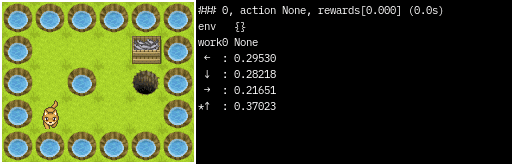
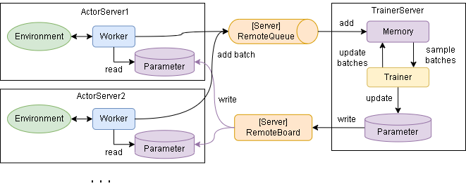

[](https://github.com/pocokhc/simple_distributed_rl/releases/latest)

# Simple Distributed Reinforcement Learning (シンプルな分散強化学習)

シンプルな分散強化学習フレームワークを目指して作成しています。  
以下の特徴があります。  

+ 分散強化学習のサポート
+ 環境とアルゴリズム間のインタフェースの自動調整
+ Gym/Gymnasiumの環境に対応
+ カスタマイズ可能な環境クラスの提供
+ カスタマイズ可能な強化学習アルゴリズムクラスの提供
+ 有名な強化学習アルゴリズムの提供
+ （新しいアルゴリズムへの対応）

**ドキュメント**

<https://pocokhc.github.io/simple_distributed_rl/>


**アルゴリズムの解説記事（Qiita）**

<https://qiita.com/pocokhc/items/a2f1ba993c79fdbd4b4d>

# 1. Install/Download

**Required library**

``` bash
pip install numpy
```

**Option Libraries**

使う機能によって以下のライブラリが必要になります。

+ Tensorflow が必要なアルゴリズムを使用する場合
  + tensorflow
  + tensorflow-probability
+ Torch が必要なアルゴリズムを使用する場合
  + <https://pytorch.org/get-started/locally/>
+ 主に画像関係の機能を使用する場合
  + pillow
  + opencv-python
  + pygame
+ 主にhistoryによる統計情報を扱う場合
  + pandas
  + matplotlib
+ OpenAI Gym の環境を使用する場合
  + gym or gymnasium
  + pygame
+ ハードウェアの統計情報を表示する場合
  + psutil
  + pynvml
+ クラウド/ネットワークによる分散学習を使用する場合
  + redis
  + pika
  + paho-mqtt

Tensorflow,Torch,pika,paho-mqttを除いたライブラリを一括でインストールするコマンドは以下です。

``` bash
pip install matplotlib pillow opencv-python pygame pandas gymnasium psutil pynvml redis
```

## Install

本フレームワークはGitHubからインストールまたはダウンロードをして使う事を想定しています。

``` bash
pip install git+https://github.com/pocokhc/simple_distributed_rl
```

or

``` bash
git clone https://github.com/pocokhc/simple_distributed_rl.git
cd simple_distributed_rl
pip install .
```

## Download (No install)

srlディレクトリに実行パスが通っていればダウンロードだけでも使えます。

``` bash
# Download srl files
git clone https://github.com/pocokhc/simple_distributed_rl.git
```

``` python
# Example import srl
import os
import sys

assert os.path.isdir("./simple_distributed_rl/srl/")  # Location of srl
sys.path.insert(0, "./simple_distributed_rl/")

import srl
print(srl.__version__)
```


# 2. Usage

簡単な使い方は以下です。

``` python
import srl
from srl.algorithms import ql  # algorithm load


def main():
    # create runner
    runner = srl.Runner("Grid", ql.Config())

    # train
    runner.train(timeout=10)

    # evaluate
    rewards = runner.evaluate()
    print(f"evaluate episodes: {rewards}")

    # --- animation sample
    #  (Run "pip install opencv-python pillow pygame" to use the animation)
    runner.render_window()
    # runner.animation_save_gif("Grid.gif")  # save image


if __name__ == "__main__":
    main()

```



その他の使い方は以下ドキュメントを見てください。

+ [How To Use](https://pocokhc.github.io/simple_distributed_rl/pages/howtouse.html)


# 3. Framework Overview

+ Sequence flow


+ Distributed flow



+ Simplified pseudo code(train)

``` python
# Initializing phase
env.setup()
worker.on_start()

# 1 episode initializing phase
env.reset()
worker.on_reset()

# 1 episode loop
while not env.done:
    action = worker.policy()  # parameter reference
    env.step(action)
    worker.on_step()

    # Train phase
    baths = memory.sample()
    trainer.train(baths)  # parameter update
```

+ Simplified pseudo code(not train)

``` python
# Initializing phase
env.setup()
worker.on_start()

# 1 episode initializing phase
env.reset()
worker.on_reset()

# 1 episode loop
while not env.done:
    env.render()
    action = worker.policy()  # parameter reference
    worker.render()
    env.step(action)
    worker.on_step()
env.render()
worker.render()
```


# 4. Customize

オリジナル環境とアルゴリズムの作成に関しては以下ドキュメントを参考にしてください。

+ [Make Original Environment](https://pocokhc.github.io/simple_distributed_rl/pages/custom_env.html)
+ [Make Original Algorithm](https://pocokhc.github.io/simple_distributed_rl/pages/custom_algorithm.html)


# 5. Algorithms

## ModelFree

### ValueBase

|Algorithm |Observation|Action  |Tensorflow|Torch|ProgressRate||
|----------|-----------|--------|----------|-----|------------|---|
|QL        |Discrete   |Discrete|-         |- |100%|Basic Q Learning|
|DQN       |Continuous |Discrete|✔        |✔|100%||
|C51       |Continuous |Discrete|✔        |- |99%|CategoricalDQN|
|Rainbow   |Continuous |Discrete|✔        |✔|100%||
|R2D2      |Continuous |Discrete|✔        |- |100%||
|Agent57   |Continuous |Discrete|✔        |✔|100%||
|SND       |Continuous |Discrete|✔        |✔|100%||


### PolicyBase/ActorCritic

|Algorithm     |Observation|Action    |Tensorflow|Torch|ProgressRate||
|--------------|-----------|----------|----------|-----|---|---|
|VanillaPolicy |Discrete   |Both      |-         |-    |100%||
|A3C/A2C       |-          |-         |-         |-    |-   ||
|TRPO          |-          |-         |-         |-    |-   ||
|PPO           |Continuous |Both      |✔        |-    |100%||
|DDPG/TD3      |Continuous |Continuous|✔        |-    |100%||
|SAC           |Continuous |Both      |✔        |-    |100%||

## AlphaSeries

|Algorithm  |Observation|Action  |Tensorflow|Torch|ProgressRate||
|-----------|-----------|--------|----------|-----|---|---|
|MCTS       |Discrete   |Discrete|-         |-    |100%|MDP base|
|AlphaZero  |Image      |Discrete|✔        |-    |100%|MDP base|
|MuZero     |Image      |Discrete|✔        |-    |100%|MDP base|
|StochasticMuZero|Image |Discrete|✔        |-    |100%|MDP base|

## ModelBase

|Algorithm  |Observation|Action     |Framework|ProgressRate|
|-----------|-----------|-----------|---------|----|
|DynaQ      |Discrete   |Discrete   |-        |100%|

### WorldModels

|Algorithm  |Observation|Action     |Tensorflow|Torch|ProgressRate||
|-----------|-----------|-----------|----------|-----|---|---|
|WorldModels|Continuous |Discrete   |✔        |-    |100%||
|PlaNet     |Continuous |Discrete   |✔(+tensorflow-probability)|-|100%||
|Dreamer    |Continuous |Both       |-|-|merge DreamerV3|
|DreamerV2  |Continuous |Both       |-|-|merge DreamerV3|
|DreamerV3  |Continuous |Both       |✔(+tensorflow-probability)|-|100%||

## Offline

|Algorithm  |Observation|Action     |Framework|ProgressRate|
|-----------|-----------|-----------|----------|----|
|CQL        |Discrete   |Discrete   |          |  0%|

## Original

|Algorithm    |Observation|Action  |Type     |Tensorflow|Torch|ProgressRate||
|-------------|-----------|--------|---------|----------|-----|---|---|
|QL_agent57   |Discrete   |Discrete|ValueBase|-         |-    |80%|QL + Agent57|
|Agent57_light|Continuous |Discrete|ValueBase|✔        |✔   |100%|Agent57 - (LSTM,MultiStep)|
|SearchDynaQ  |Discrete   |Discrete|ModelBase|-         |-    |100%|original|
|SearchDreamer|Continuous |Discrete|ModelBase|✔        |-    |0%|original|


# 6. Distributed Learning (Online)

ネットワーク経由での分散学習は以下のドキュメントを参照してください。

+ [Distributed Learning (Online)](https://pocokhc.github.io/simple_distributed_rl/pages/distributed.html)

またクラウドサービスとの連携はQiita記事を参照

+ [クラウドサービスを利用した分散強化学習（無料編）](https://qiita.com/pocokhc/items/f7a32ee6c62cba54d6ab)
+ [クラウドサービスを利用した分散強化学習（kubernetes編）](https://qiita.com/pocokhc/items/56c930e1e401ce156141)
+ [クラウドサービスを利用した分散強化学習（GKE/有料編）](https://qiita.com/pocokhc/items/e08aab0fe56566ab9407)


# 7. Development environment

Look "./dockers/"

+ PC1
  + windows11
  + CPUx1: Core i7-8700 3.2GHz
  + GPUx1: NVIDIA GeForce GTX 1060 3GB
  + memory 48GB
+ PC2
  + windows11
  + CPUx1: Core i9-12900 2.4GHz
  + GPUx1: NVIDIA GeForce RTX 3060 12GB
  + memory 32GB
