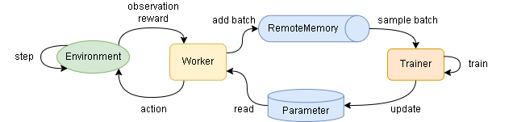
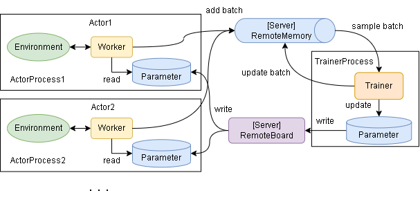
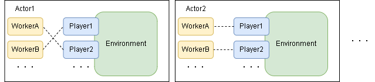
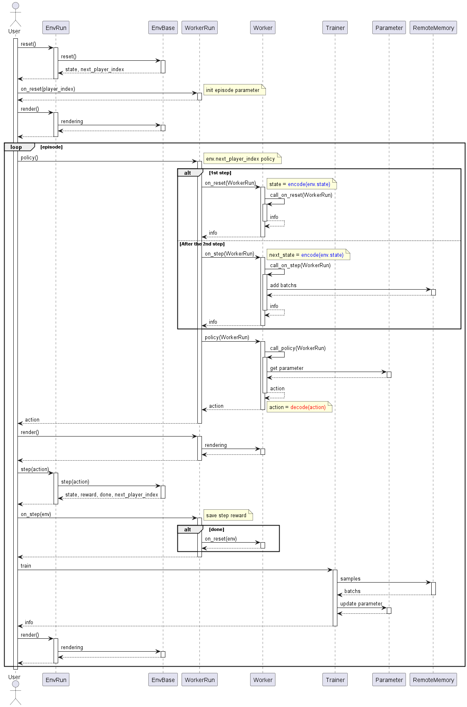
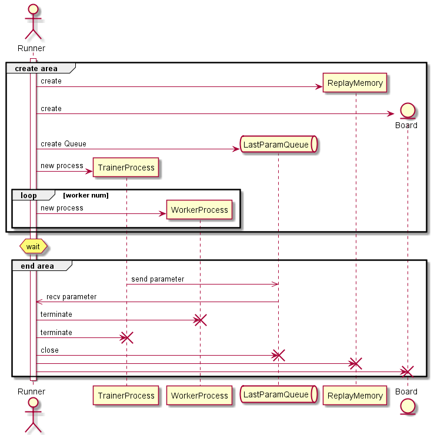
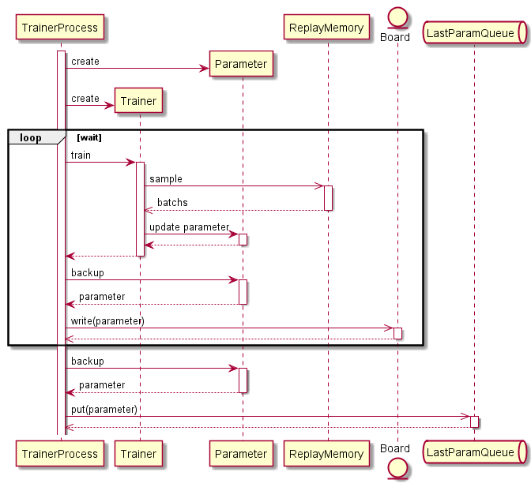
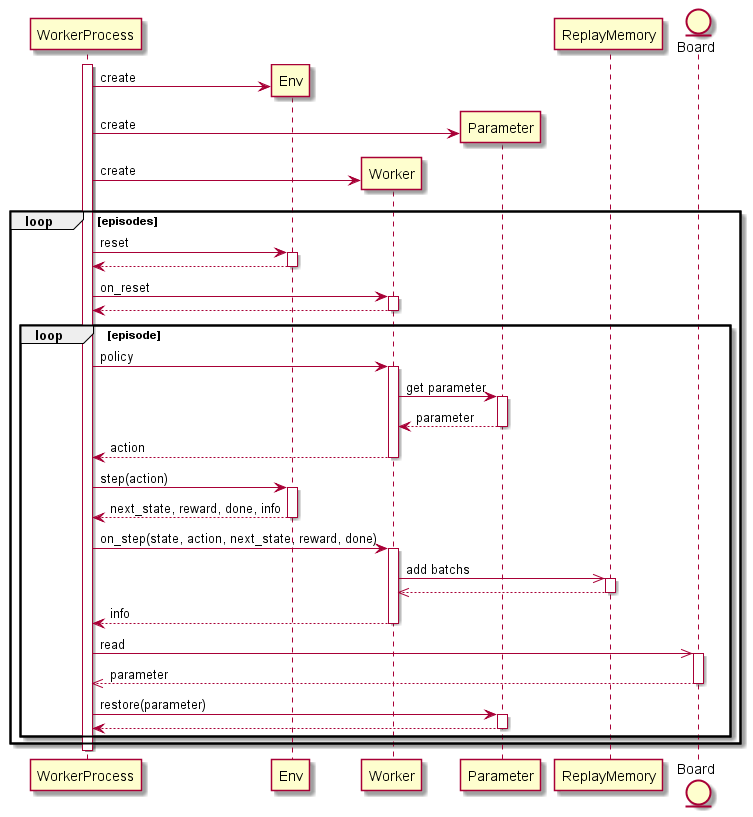
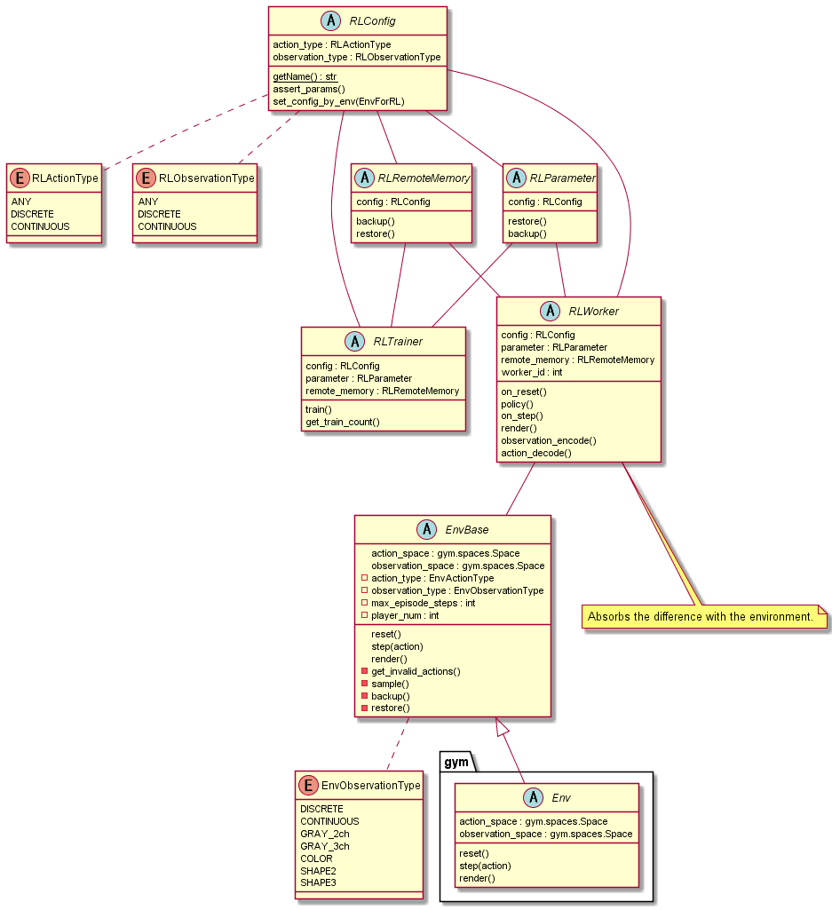

# Simple Distributed Reinforcement Learning (シンプルな分散強化学習)

シンプルな分散強化学習フレームワークを目指して作成しました。  
どちらかというと学習用フレームワークに近いかもしれません。  
以下の特徴があります。  

+ カスタマイズ可能な環境クラスの提供
+ カスタマイズ可能な強化学習アルゴリズムクラスの提供
+ 環境とアルゴリズム間のインタフェースの自動調整
+ 分散強化学習のサポート

また本フレームワークの解説は[Qiita記事](https://qiita.com/pocokhc/items/a2f1ba993c79fdbd4b4d)にて増やしていく予定なのでそちらも参照してください。


# Install

github からの pip install を想定しています。

``` bash
pip install -U git+https://github.com/pocokhc/simple_distributed_rl
```

or

``` bash
git clone https://github.com/pocokhc/simple_distributed_rl.git
cd simple_distributed_rl
pip install -U .

# run sample
python examples/minimum_runner.py
```


# Usage

``` python
import numpy as np

import srl
from srl.base.define import RenderType
from srl.runner import mp, sequence
from srl.runner.callbacks import PrintProgress, Rendering
from srl.runner.callbacks_mp import TrainFileLogger

#---------------------
# Configのパラメータは、引数補完または元コードを参照してください。
# For the parameters of Config, refer to the argument completion or the original code.
#
# srl.envs.Config   : Env Config
# srl.rl.xxx.Config : Algorithm hyperparameter
# sequence.Config   : Basic Running Config
# mp.Config         : Distributed training Config
#---------------------

def main():
    # env config
    # (Run "pip install gym pygame" to use the gym environment)
    env_config = srl.envs.Config("FrozenLake-v1")

    # rl algorithm config
    rl_config = srl.rl.ql.Config()

    # running config
    config = sequence.Config(env_config, rl_config)

    # (option) load parameter
    # config.set_parameter_path(parameter_path="params.dat")

    # --- train
    if True:
        # sequence training
        config.set_train_config(timeout=60, callbacks=[PrintProgress()])
        parameter, remote_memory = sequence.train(config)
    else:
        # distributed training
        mp_config = mp.Config(worker_num=2)  # distributed config
        config.set_train_config()
        mp_config.set_train_config(timeout=60, callbacks=[TrainFileLogger(enable_log=False, enable_checkpoint=False)])
        parameter, remote_memory = mp.train(config, mp_config)

    # (option) save parameter
    # parameter.save("params.dat")

    # --- test
    config.set_play_config(max_episodes=100)
    rewards, _, _ = sequence.play(config, parameter)
    print(f"Average reward for 100 episodes: {np.mean(rewards)}")

    # --- test(rendering)
    config.set_play_config(max_episodes=1, callbacks=[Rendering(step_stop=True)])
    sequence.play(config, parameter)

    # --- animation
    render = Rendering(mode=RenderType.NONE, enable_animation=True)
    config.set_play_config(max_episodes=1, callbacks=[render])
    sequence.play(config, parameter)
    render.create_anime(fps=3).save("FrozenLake.gif")


if __name__ == '__main__':
    main()

```


# Customize

オリジナル環境とアルゴリズムの作成例は以下のファイルを参考にしてください。

examples/custom_env.ipynb  
examples/custom_rl.ipynb  


# Algorithms

## Model Free
### Value Base

|Algorithm|AlgorithmType|ObservationType|ActionType|ProgressRate||Paper|
|---------|-----|--------------|----------------|----------|-------------|---|
|QL       |Table    |Discrete  |Discrete  |100%|Basic Q Learning||
|QL_agent57|Table   |Discrete  |Discrete  | 99%|QL + Agent57|
|DQN      |NeuralNet|Continuous|Discrete  |100%||[Paper](https://arxiv.org/pdf/1312.5602.pdf)|
|C51      |NeuralNet|Continuous|Discrete  | 99%|Categorical DQN|[Paper](https://arxiv.org/abs/1707.06887)|
|Rainbow  |NeuralNet|Continuous|Discrete  |100%||[Paper](https://arxiv.org/pdf/1710.02298.pdf)|
|R2D2  |NeuralNet|Continuous|Discrete  | 99%||[Paper](https://openreview.net/forum?id=r1lyTjAqYX)|
|Agent57  |NeuralNet|Continuous|Discrete  | 70%||[Paper](https://arxiv.org/abs/2003.13350)|
|Agent57_light  |NeuralNet|Continuous|Discrete  | 70%|Agent57 - (LSTM,MultiStep)||


### Policy Base/ActorCritic

|Algorithm|AlgorithmType|ObservationType|ActionType|ProgressRate||Paper|
|---------|-----|--------------|----------------|----------|-------------|---|
|REINFORCE |||| 0%|||
|A3C/A2C|||| 0%|||
|TRPO |NeuralNet|Continuous|Continuous| 0%|||
|PPO |NeuralNet|Continuous|Continuous| 0%|||
|DDPG/TD3 |NeuralNet|Continuous|Continuous| 0%|||
|SAC      |NeuralNet|Continuous|Continuous| 10%||[Paper](https://arxiv.org/abs/1812.05905)|


## Model Base

|Algorithm|Algorithm Type|ObservationType|ActionType|ProgressRate||Paper|
|---------|-----|--------------|----------------|----------|-------------|---|
|MCTS      |Table|Discrete|Discrete| 100%|||
|AlphaZero |Table+NeuralNet|Continuous|Discrete| 0%||[Paper](https://arxiv.org/abs/1712.01815)|
|MuZero |Table+NeuralNet|Continuous|Discrete| 0%||[Paper](https://www.nature.com/articles/s41586-020-03051-4)|
|DynaQ |Table|Discrete|Discrete| 10%|||
|WorldModels||| 0%|||
|DreamerV2||| 0%|||


# Envs

|Name|Player|ObservationType|ActionType|   |
|----|------|----------------|-----------|---|
|(gym)|     1|             Any|        Any|Open AI Gym に登録されている環境全般|
|Grid|     1|        Discrete|   Discrete|baseline|
|IGrid|    1|        Discrete|   Discrete||
|OX|    2|        Discrete|   Discrete||


# Diagrams

## Overview

* sequence flow



* distributed flow



* multiplay flow




## PlayFlow



## Distribute flow

* main



* Trainer



* Workers




## Class diagram




# Interface

|   |           |          |Type|
|---|-----------|----------|------|
|env|action     |          |Space|
|env|observation|          |Space|
|rl |action     |Discrete  |int|
|rl |action     |Continuous|list[float]|
|rl |observation|Discrete  |np.ndarray(dtype=int)|
|rl |observation|Continuous|np.ndarray(dtype=float)|

* Space(srl.base.env.spaces)

|class               |Type       |
|--------------------|-----------|
|DiscreteSpace       |int        |
|ArrayDiscreteSpace  |list[int]  |
|ContinuousSpace     |float      |
|ArrayContinuousSpace|list[float]|
|BoxSpace            |np.ndarray |

