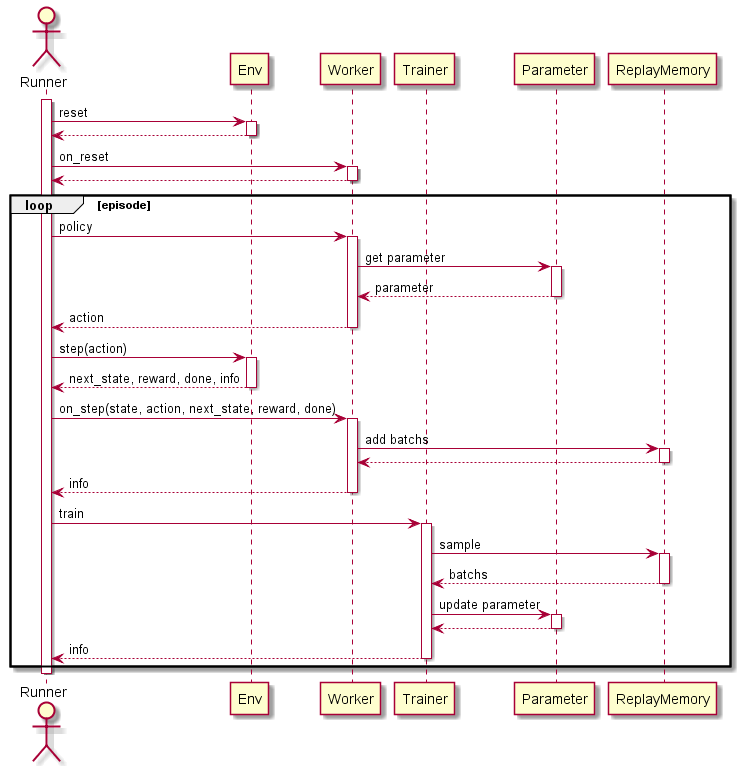

(まだ作成中です)(WIP)

# Simple Reinforcement Learning (シンプルな強化学習)

シンプルな強化学習フレームワークを目指して作成しました。  
どちらかというと強化学習の学習用フレームワークです。  
以下の特徴があります。  

+ 分散強化学習のサポート
+ カスタマイズ可能な環境
+ カスタマイズ可能な強化学習アルゴリズム


# Install

github からの pip install または clone を想定しています。

``` bash
pip install git+https://github.com/pocokhc/simple_rl
```

or

``` bash
# pip
pip install tensorflow (or tensorflow-cpu or tensorflow-gpu)
pip install gym numpy tensorflow-addons matplotlib opencv-python psutil pynvml ipython
pip install dataclasses  # py3.6

# clone & sample run
git clone https://github.com/pocokhc/simple_rl.git
cd simple_rl/examples
python sample_minimum_runner.py
```


# Usage

``` python
from srl import rl
from srl.runner import mp, sequence
from srl.runner.callbacks import PrintProgress, Rendering
from srl.runner.callbacks_mp import TrainFileLogger

#---------------------
# Configのパラメータは、引数補完または元コードを参照してください。
# For the parameters of Config, refer to the argument completion or the original code.
#
# rl.xxx.Config   : Algorithm hyperparameters
# sequence.Config : Basic Running Config
# mp.Config       : Distributed Config
#---------------------

# rl algorithm config
rl_config = rl.ql.Config()

# running config
config = sequence.Config(
    env_name="FrozenLake-v1",  # select env
    rl_config=rl_config,
)

# --- train
if True:
    # sequence training
    config.set_play_config(timeout=60, training=True, callbacks=[PrintProgress()])
    episode_rewards, parameter, memory = sequence.play(config)
else:
    # distribute training
    mp_config = mp.Config(worker_num=2)  # select distribute config
    mp_config.set_train_config(timeout=60, callbacks=[TrainFileLogger(enable_log=True, enable_checkpoint=False)])
    parameter = mp.train(config, mp_config)

# --- test
config.set_play_config(max_episodes=10, callbacks=[PrintProgress()])
sequence.play(config, parameter)

# --- test(rendering)
config.set_play_config(max_episodes=1, callbacks=[Rendering()])
sequence.play(config, parameter)
```


# Examples

実装例は以下のファイルを参照してください。

|path                      |   |
|--------------------------|---|
|examples/sample_minimum_raw_sequence.py|逐次学習の最低限の実装内容|
|examples/sample_minimum_raw_mp.py      |分散学習の最低限の実装内容|
|examples/sample_minimum_runner.py      |runnerを使う場合の最低限の実装内容|
|examples/sample_custom.py       |自作環境を使った実行例|
|examples/env/my_env_gym.py      |GymEnvの実装例|
|examples/env/my_env.py          |本ライブラリ用のEnvの実装例|
|examples/rl/my_rl_table.py      |アルゴリズムの実装例(テーブル形式)|
|examples/rl/my_rl_discrete_action.py|アルゴリズムの実装例(ニューラルネット、離散行動空間))|
|examples/rl/my_rl_continuous_action.py|アルゴリズムの実装例(ニューラルネット、連続行動空間)|


# Algorithms

## Model Free
### Value Base

|Algorithm|Algorithm Type|Observation Type|Action Type|Progress Rate||Paper|
|---------|-----|--------------|----------------|----------|-------------|---|
|QL       |Table    |Discrete  |Discrete  |100%|Basic Q Learning||
|QL_agent57|Table   |Discrete  |Discrete  |100%|QL + Agent57|
|DQN      |NeuralNet|Continuous|Discrete  |100%||[Paper](https://arxiv.org/pdf/1312.5602.pdf)|
|C51      |NeuralNet|Continuous|Discrete  | 90%|Categorical DQN|[Paper](https://arxiv.org/abs/1707.06887)|
|Rainbow  |NeuralNet|Continuous|Discrete  | 90%||[Paper](https://arxiv.org/pdf/1710.02298.pdf)|
|R2D2  |NeuralNet|Continuous|Discrete  | 70%||[Paper](https://openreview.net/forum?id=r1lyTjAqYX)|
|Agent57  |NeuralNet|Continuous|Discrete  | 0%||[Paper](https://arxiv.org/abs/2003.13350)|
|Agent57_light  |NeuralNet|Continuous|Discrete  | 90%|Agent57 - (LSTM,MultiStep)||


### Policy Base/ActorCritic

|Algorithm|Algorithm Type|Observation Type|Action Type|Progress Rate||Paper|
|---------|-----|--------------|----------------|----------|-------------|---|
|SAC      |NeuralNet|Continuous|Continuous| 70%||[Paper](https://arxiv.org/abs/1812.05905)|


## Model Base

|Algorithm|Algorithm Type|Observation Type|Action Type|Progress Rate||Paper|
|---------|-----|--------------|----------------|----------|-------------|---|
|MCTS      |Table|Discrete|Discrete| 100%|Single play||
|AlphaZero |Table/NeuralNet|Continuous|Discrete| -%|Single play|[Paper](https://arxiv.org/abs/1712.01815)|
|MuZero |Table/NeuralNet|Continuous|Discrete| -%||[Paper](https://www.nature.com/articles/s41586-020-03051-4)|


# Diaglams
## Sequence flow



## Distribute flow

* main


* Trainer


* Workers


## Class diagram


