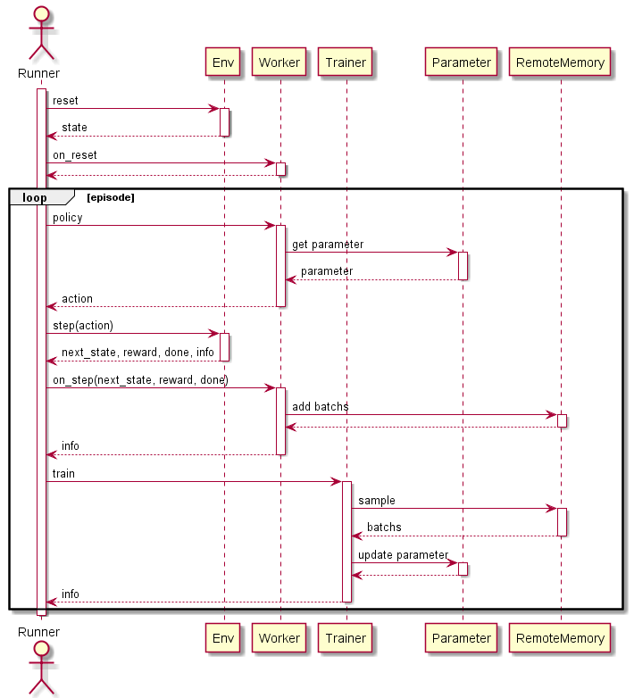
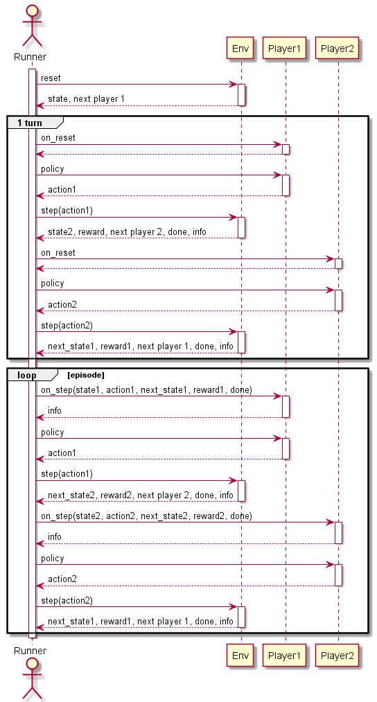
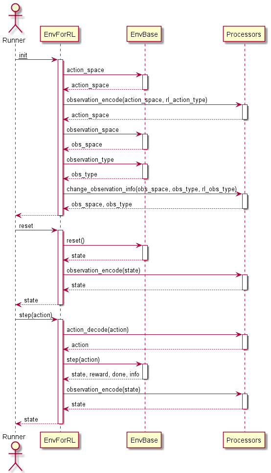

# Simple Reinforcement Learning (シンプルな強化学習)

シンプルな強化学習フレームワークを目指して作成しました。  
どちらかというと強化学習の学習用フレームワークです。  
以下の特徴があります。  

+ カスタマイズ可能な環境
+ カスタマイズ可能な強化学習アルゴリズム
+ 環境とアルゴリズム間のインタフェースの自動調整
+ 分散強化学習のサポート


# Install

github からの pip install を想定しています。

``` bash
pip install git+https://github.com/pocokhc/simple_rl
```

or

``` bash
git clone https://github.com/pocokhc/simple_rl.git
cd simplr_rl
pip install .

# run sample
python examples/minimum_runner.py
```


# Usage

``` python
import srl
from srl.runner import mp, sequence
from srl.runner.callbacks import PrintProgress, Rendering
from srl.runner.callbacks_mp import TrainFileLogger

#---------------------
# Configのパラメータは、引数補完または元コードを参照してください。
# For the parameters of Config, refer to the argument completion or the original code.
#
# srl.envs.Config   : Env processors Config
# srl.rl.xxx.Config : Algorithm hyperparameters
# sequence.Config   : Basic Running Config
# mp.Config         : Distributed training Config
#---------------------

# env config
env_config = srl.envs.Config("FrozenLake-v1")

# rl algorithm config
rl_config = rl.ql.Config()

# running config
config = sequence.Config(env_config, rl_config)

# (option) load parameter
# config.set_parameter_path(parameter_path="params.dat")

# --- train
if True:
    # sequence training
    config.set_train_config(timeout=60, callbacks=[PrintProgress()])
    parameter, memory = sequence.train(config)
else:
    # distribute training
    mp_config = mp.Config(worker_num=2)  # distribute config
    config.set_train_config()
    mp_config.set_train_config(timeout=60, callbacks=[TrainFileLogger(enable_log=False, enable_checkpoint=False)])
    parameter, memory = mp.train(config, mp_config)

# (option) save parameter
# parameter.save("params.dat")

# --- test
config.set_play_config(max_episodes=10, callbacks=[PrintProgress()])
rewards, _, _ = sequence.play(config, parameter)
print(f"test reward mean: {np.mean(rewards)}")

# --- test(rendering)
render = Rendering(step_stop=True)
config.set_play_config(max_episodes=1, callbacks=[render])
sequence.play(config, parameter)
```


# Interfaces
## Env

すべてのEnvは "srl.base.env.EnvBase" クラスを継承します。
EnvBaseは複数人でやるターン制のゲーム(環境)を想定しています。

各環境に特化した基底クラスは以下です。（今後増える可能性があります）

|Name                         |Player|ObservationType|ActionType|ex|
|-----------------------------|------|---------------|----------|---|
|SingleActionDiscrete         |     1|            Any|  Discrete|Atari games|
|SingleActionContinuous       |     1|            Any|Continuous|Pendulum-v1|
|TurnBase2PlayerActionDiscrete|     2|            Any|  Discrete|OX|


## RL

すべてのRLは分散学習に対応するため、以下のクラスを継承します。

``` python
srl.base.rl.base.RLConfig
srl.base.rl.base.RLRemoteMemory
srl.base.rl.base.RLParameter
srl.base.rl.base.RLTrainer
srl.base.rl.base.RLWorker
```

各アルゴリズムに特化した基底クラスは以下です。（今後増える可能性があります）

|Name                |ObservationType|ActionType|              Config|       Worker|ex|
|--------------------|---------------|----------|--------------------|--------------------|---|
|Table               |       Discrete|  Discrete|TableConfig         |TableWorker         |QL|
|NeuralnetDiscrete   |     Continuous|  Discrete|DiscreteActionConfig|DiscreteActionWorker|DQN|
|NeuralnetContinuous|     Continuous|  Continuous|ContinuousActionConfig|ContinuousActionWorker|SAC|
|AlphaZero          |     TODO|  TODO| TODO| TODO|MCTS|
|ModelBase          |     TODO|  TODO| TODO| TODO|DynaQ|
|WorldModels        |     TODO|  TODO| TODO| TODO|WorldModels|


* RLParameter, RLTrainer
RLParameterとRLTrainerは現状特化したクラスはありません。

* RemoteMemroy
RemoteMemroyはアルゴリズムに依存しない部分が大きいので別途定義しています。

|Name                    ||
|------------------------|---|
|SequenceRemoteMemory    |経験を順番通りに取り出す|
|ExperienceReplayBuffer  |経験をランダムに取り出す|
|PriorityExperienceReplay|経験を優先順位に基づいて取り出す|


* RuleBase
強化学習以外の手法としてルールベースのアルゴリズムもサポートしています。


# Algorithms

## Model Free
### Value Base

|Algorithm|AlgorithmType|ObservationType|ActionType|ProgressRate||Paper|
|---------|-----|--------------|----------------|----------|-------------|---|
|QL       |Table    |Discrete  |Discrete  |100%|Basic Q Learning||
|QL_agent57|Table   |Discrete  |Discrete  |100%|QL + Agent57|
|DQN      |NeuralNet|Continuous|Discrete  |100%||[Paper](https://arxiv.org/pdf/1312.5602.pdf)|
|C51      |NeuralNet|Continuous|Discrete  | 90%|Categorical DQN|[Paper](https://arxiv.org/abs/1707.06887)|
|Rainbow  |NeuralNet|Continuous|Discrete  | 90%||[Paper](https://arxiv.org/pdf/1710.02298.pdf)|
|R2D2  |NeuralNet|Continuous|Discrete  | 90%||[Paper](https://openreview.net/forum?id=r1lyTjAqYX)|
|Agent57  |NeuralNet|Continuous|Discrete  | 70%||[Paper](https://arxiv.org/abs/2003.13350)|
|Agent57_light  |NeuralNet|Continuous|Discrete  | 90%|Agent57 - (LSTM,MultiStep)||


### Policy Base/ActorCritic

|Algorithm|AlgorithmType|ObservationType|ActionType|ProgressRate||Paper|
|---------|-----|--------------|----------------|----------|-------------|---|
|SAC      |NeuralNet|Continuous|Continuous| 70%||[Paper](https://arxiv.org/abs/1812.05905)|


## Model Base

|Algorithm|Algorithm Type|ObservationType|ActionType|ProgressRate||Paper|
|---------|-----|--------------|----------------|----------|-------------|---|
|MCTS      |Table|Discrete|Discrete| 100%|Single play||
|AlphaZero |Table+NeuralNet|Continuous|Discrete| -%|Single play|[Paper](https://arxiv.org/abs/1712.01815)|
|MuZero |Table+NeuralNet|Continuous|Discrete| -%||[Paper](https://www.nature.com/articles/s41586-020-03051-4)|
|DynaQ |Table|Discrete|Discrete| 90%|||


# Envs

|Name|Player|ObservationType|ActionType|   |
|----|------|----------------|-----------|---|
|(gym)|     1|             Any|        Any|Open AI Gym に登録されている環境全般|
|Grid|     1|        Discrete|   Discrete|baseline|
|IGrid|    1|        Discrete|   Discrete||
|OX|    2|        Discrete|   Discrete||


# Diaglams
## SinglePlay flow



## Distribute flow

* main


* Trainer


* Workers


## MultiPlay flow




## Class diagram


## EnvForRL flow


