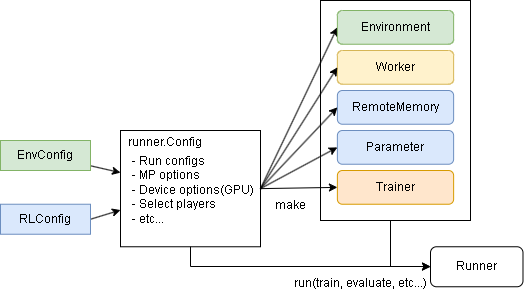

[](https://github.com/pocokhc/simple_distributed_rl/releases/latest)

# Simple Distributed Reinforcement Learning (シンプルな分散強化学習)

シンプルな分散強化学習フレームワークを目指して作成しました。  
どちらかというと学習用フレームワークに近いかもしれません。  
以下の特徴があります。  

+ 標準で分散強化学習のサポート
+ 環境とアルゴリズム間のインタフェースの自動調整
+ 上記を満たすカスタマイズ可能な環境クラスの提供
+ 上記を満たすカスタマイズ可能な強化学習アルゴリズムクラスの提供
+ 有名な強化学習アルゴリズムの提供
+ （新しいアルゴリズムへの対応）

また本フレームワークの解説は[Qiita記事](https://qiita.com/pocokhc/items/a2f1ba993c79fdbd4b4d)にして記載しています。
アルゴリズムの解説等をしているのでハイパーパラメータの設定等に迷ったりしたら見てみてください。

その他ドキュメントはこちらです： <https://pocokhc.github.io/simple_distributed_rl/>

# 1. Install/Download

numpyライブラリだけ必須になるので入れてください。

``` bash
pip install numpy
```

本フレームワークはGitHubからインストールまたはダウンロードをして使うことができます。

## Install

インストールするコマンド例は以下です。

``` bash
pip install git+https://github.com/pocokhc/simple_distributed_rl
```

or

``` bash
git clone https://github.com/pocokhc/simple_distributed_rl.git
cd simple_distributed_rl
pip install .
```

## Download (No install)

srlディレクトリに実行パスが通っていればダウンロードだけでも使えます。

``` bash
# Download srl files
git clone https://github.com/pocokhc/simple_distributed_rl.git
```

``` python
# srl までのパスを通してimportする例
import os
import sys

assert os.path.isdir("./simple_distributed_rl/srl/")  # srlがここにある想定です
sys.path.insert(0, "./simple_distributed_rl/")

import srl
print(srl.__version__)
```

## Option library

その他、機能によっては以下ライブラリが必要になります。

+ Tensorflow が必要なアルゴリズムを使う場合に必要
  + tensorflow
  + tensorflow-addons
  + tensorflow-probability
+ Torch が必要なアルゴリズムを使う場合に必要
  + <https://pytorch.org/get-started/locally/>
+ RGBの描画関係を使用する場合に必要
  + matplotlib
  + pillow
  + opencv-python
  + pygame
+ 統計情報を扱う場合に必要
  + pandas
+ OpenAI Gym の環境を使う場合に必要
  + gym
  + pygame
+ Profile情報を表示する場合に必要
  + psutil
  + pynvml

Tensorflow,Torchを除いたライブラリを一括でインストールするコマンドは以下です。

``` bash
pip install matplotlib pillow opencv-python pygame pandas gym psutil pynvml
```

# 2. Usage

## Basic run of study

``` python
from srl import runner

# --- env & algorithm load
from srl.envs import grid  # isort: skip # noqa F401
from srl.algorithms import ql  # isort: skip


def main():
    # create config
    config = runner.Config("Grid", ql.Config())

    # train
    parameter, _, _ = runner.train(config, timeout=10)

    # evaluate
    rewards = runner.evaluate(config, parameter, max_episodes=10)
    print(f"evaluate episodes: {rewards}")


if __name__ == "__main__":
    main()

```

## Commonly run Example

学習と評価を別々で実行できる形式です。

``` python
import os

import numpy as np

import srl
from srl import runner

# --- use env & algorithm load
# (Run "pip install gym pygame" to use the gym environment)
import gym  # isort: skip # noqa F401
from srl.algorithms import ql  # isort: skip

# --- save parameter path
_parameter_path = "_params.dat"


# --- sample config
# For the parameters of Config, refer to the argument completion or the original code.
def _create_config():
    env_config = srl.EnvConfig("FrozenLake-v1")
    rl_config = ql.Config()
    config = runner.Config(env_config, rl_config)
    parameter = config.make_parameter()

    # --- Loads the file if it exists
    if os.path.isfile(_parameter_path):
        parameter.load(_parameter_path)

    return config, parameter


# --- train sample
def train():
    config, parameter = _create_config()

    if True:
        # sequence training
        parameter, remote_memory, history = runner.train(config, parameter=parameter, timeout=60)
    else:
        # distributed training
        parameter, remote_memory, history = runner.train_mp(config, parameter=parameter, timeout=60)

    # save parameter
    parameter.save(_parameter_path)


# --- evaluate sample
def evaluate():
    config, parameter = _create_config()
    rewards = runner.evaluate(config, parameter, max_episodes=100)
    print(f"Average reward for 100 episodes: {np.mean(rewards)}")


# --- render sample
# You can watch the progress of 1 episode
def render():
    config, parameter = _create_config()
    runner.render(config, parameter)


# --- render window sample
#  (Run "pip install opencv-python pillow matplotlib pygame" to use the animation)
def render_window():
    config, parameter = _create_config()
    runner.render_window(config, parameter)


# --- animation sample
#  (Run "pip install opencv-python pillow matplotlib pygame" to use the animation)
def animation():
    config, parameter = _create_config()
    render = runner.animation(config, parameter)
    render.create_anime().save("_FrozenLake.gif")


if __name__ == "__main__":
    train()
    evaluate()
    render()
    render_window()
    animation()

```


# 3. Framework Overview

+ Sequence flow


+ Distributed flow


+ Runner



+ Simplified pseudo code

``` python
# Initializing phase
env.reset()
worker.on_reset(env)
env.render()

# 1 episode loop
while not env.done:
    action = worker.policy(env)
    worker.render(env)
    env.step(action)
    worker.on_step(env)
    env.render()
```

# 4. Algorithms

## ModelFree

### ValueBase

|Algorithm |Observation|Action  |Framework|ProgressRate||
|----------|-----------|--------|----------|----|---|
|QL        |Discrete   |Discrete|          |100%|Basic Q Learning|
|DQN       |Continuous |Discrete|Tensorflow/Torch|100%||
|C51       |Continuous |Discrete|Tensorflow| 99%|CategoricalDQN|
|Rainbow   |Continuous |Discrete|Tensorflow/Torch|100%||
|R2D2      |Continuous |Discrete|Tensorflow|100%||
|Agent57   |Continuous |Discrete|Tensorflow|100%||

### PolicyBase/ActorCritic

|Algorithm              |Observation|Action    |Framework|ProgressRate|
|-----------------------|-----------|----------|----------|----|
|VanillaPolicy          |Discrete   |Both      ||100%|
|A3C/A2C                |           |          ||  0%|
|TRPO                   |Continuous |          ||   -|
|PPO                    |Continuous |          ||  0%|
|DDPG/TD3               |Continuous |Continuous|Tensorflow|100%|
|SAC                    |Continuous |Continuous|Tensorflow|100%|

## AlphaSeries

|Algorithm  |Observation|Action  |Framework|ProgressRate||
|-----------|-----------|--------|----------|----|---|
|MCTS       |Discrete   |Discrete|          |100%|MDP base|
|AlphaZero  |Image      |Discrete|Tensorflow|100%|MDP base|
|MuZero     |Image      |Discrete|Tensorflow|100%|MDP base|
|StochasticMuZero|Image |Discrete|Tensorflow|100%|MDP base|

## ModelBase

|Algorithm  |Observation|Action     |Framework|ProgressRate|
|-----------|-----------|-----------|----------|----|
|DynaQ      |Discrete   |Discrete   | 10%|

### WorldModels

|Algorithm  |Observation|Action     |Framework|ProgressRate|
|-----------|-----------|-----------|----------|----|
|WorldModels|Continuous |Discrete   |Tensorflow|100%|
|PlaNet     |Continuous |Discrete   |Tensorflow,tensorflow-probability|100%|
|Dreamer    |           |           |Tensorflow,tensorflow-probability|  0%|
|DreamerV2  |           |           ||  0%|

## Offline

|Algorithm  |Observation|Action     |Framework|ProgressRate|
|-----------|-----------|-----------|----------|----|
|CQL        |Discrete   |Discrete   ||  0%|

## その他(Original)

|Algorithm    |Observation|Action  |Type     |Framework|ProgressRate||
|-------------|-----------|--------|---------|----------|----|---|
|QL_agent57   |Discrete   |Discrete|ValueBase|          | 80%|QL + Agent57|
|Agent57_light|Continuous |Discrete|ValueBase|Tensorflow|100%|Agent57 - (LSTM,MultiStep)|
|SearchDynaQ  |Discrete   |Discrete|ModelBase/ValueBase|| 80%|original|

# 5. Customize

オリジナル環境とアルゴリズムの作成に関しては以下ドキュメントを参考にしてください。

+ [Create Original Environment](https://pocokhc.github.io/simple_distributed_rl/pages/custom_env.html)
+ [Create Original Algorithm](https://pocokhc.github.io/simple_distributed_rl/pages/custom_algorithm.html)

# 6. Detailed framework information

## Multiplay flow


## Play flow


## Distribute flow

+ **main**


+ **Trainer**


+ **Workers**


## Class diagram


## Interface

+ Env input/output type

|   |           |Type |
|---|-----------|-----|
|Env|action     |Space|
|Env|observation|Space|

+ RL input/output type

|   |          |           |Type|
|---|----------|-----------|------|
|RL |Discrete  |action     |int|
|RL |Discrete  |observation|NDArray[int]|
|RL |Continuous|action     |list[float]|
|RL |Continuous|observation|NDArray[np.float32]|

+ Space(srl.base.env.spaces)

|Class               |Type       |
|--------------------|-----------|
|DiscreteSpace       |int        |
|ArrayDiscreteSpace  |list[int]  |
|ContinuousSpace     |float      |
|ArrayContinuousSpace|list[float]|
|BoxSpace            |NDArray[np.float32]|

# 7. Development environment

Look "./dockers/"

+ PC1
  + windows11
  + CPUx1: Core i7-8700 3.2GHz
  + GPUx1: NVIDIA GeForce GTX 1060 3GB
  + memory 48GB
+ PC2
  + windows11
  + CPUx1: Core i9-12900 2.4GHz
  + GPUx1: NVIDIA GeForce RTX 3060 12GB
  + memory 32GB
