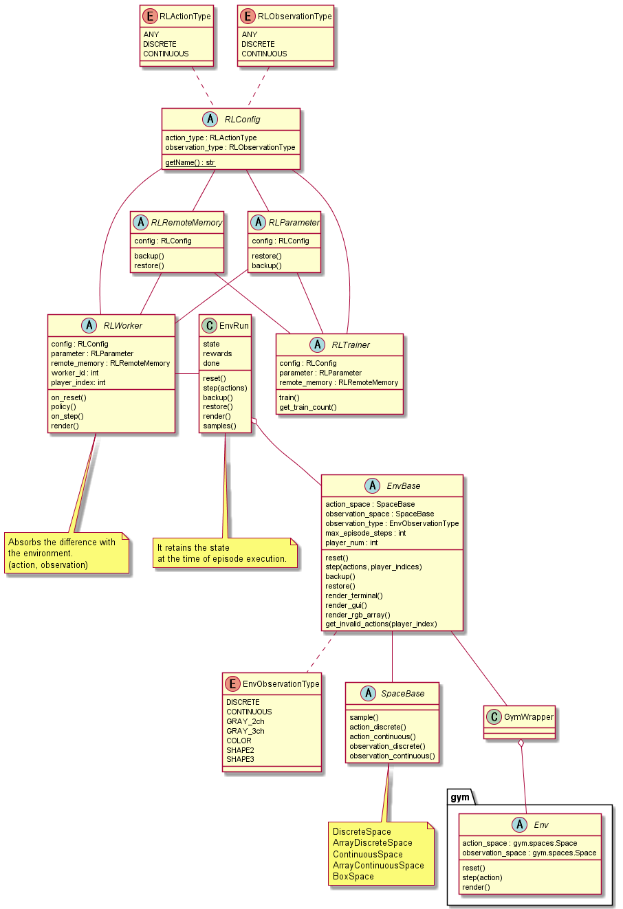

(まだ作成中です)(WIP)

# Simple Reinforcement Learning (シンプルな強化学習)

シンプルな強化学習フレームワークを目指して作成しました。
以下の特徴があります。

+ 分散強化学習の標準サポート
+ カスタマイズ可能な環境
+ カスタマイズ可能な強化学習アルゴリズム


# Install

今のところは github からの pip install を想定しています。

``` bash
pip install git+https://github.com/pocokhc/simple_rl
```


# Usage

``` python
from srl import rl
from srl.runner import sequence. mp
from srl.runner.callbacks import PrintProgress, RenderingEpisode

# config
config = sequence.Config(
    env_name="FrozenLake-v1",  # select env
    rl_config=rl.ql.Config(),  # select rl & rl config
    memory_config=rl.memory.remote_memory.Config(),  # select memory & memory config
)

# train
if True:
    # sequence training
    config.set_play_config(timeout=60, training=True, callbacks=[PrintProgress()])
    episode_rewards, parameter, memory = sequence.play(config)
else:
    # distribute training
    mp_config = mp.Config(worker_num=2)  # select distribute config
    mp_config.set_train_config(timeout=60, callbacks=[TrainFileLogger(enable_log=False, enable_checkpoint=False)])
    parameter = mp.train(config, mp_config)

# test
config.set_play_config(max_episodes=10, callbacks=[PrintProgress()])
sequence.play(config, parameter)

# test(rendering)
config.set_play_config(max_episodes=1, callbacks=[RenderingEpisode()])
sequence.play(config, parameter)
```


# Examples

実装例は以下のファイルを参照してください。

|path                      |   |
|--------------------------|---|
|examples/minimum_raw_sequence.py|逐次学習の最低限の実装内容|
|examples/minimum_raw_mp.py      |分散学習の最低限の実装内容|
|examples/sample_custom.py       |自作環境を使った実行例|
|examples/env/my_env_gym.py      |GymEnvの実装例|
|examples/env/my_env.py          |本ライブラリ用のEnvの実装例|
|examples/rl/my_rl_table.py      |アルゴリズムの実装例(テーブル形式)|
|examples/rl/my_rl_discrete_action.py|アルゴリズムの実装例(ニューラルネット、離散行動空間))|
|examples/rl/my_rl_continuous_action.py|アルゴリズムの実装例(ニューラルネット、連続行動空間)|


# Algorithms


|Algorithm|Observation Type|Action Type|Progress Rate|
|---------|----------------|-----------|-------------|
|QL       |Discrete        |Discrete   |100%         |
|DQN      |Continuous      |Discrete   |100%         |
|Rainbow  |Continuous      |Discrete   | 90%         |


# Other Info


* Sequence flow


* Distribute flow


* Class diagram




