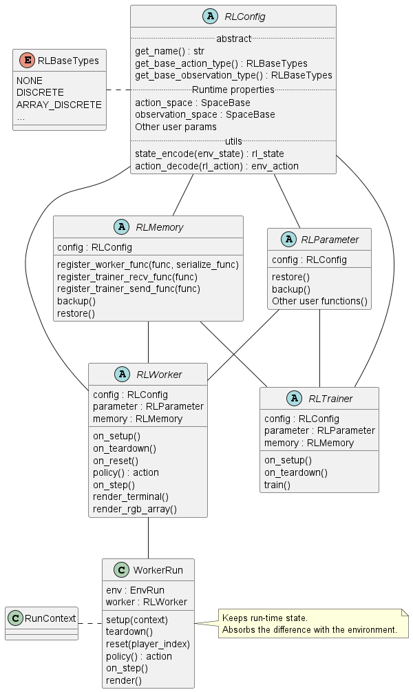
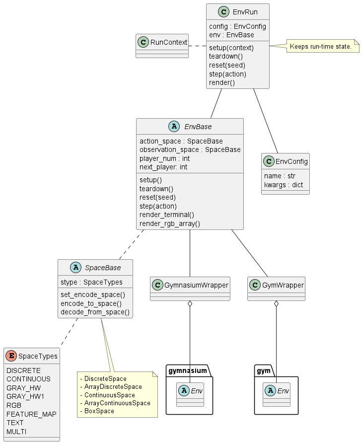

# Simple Distributed Reinforcement Learning (シンプルな分散強化学習)

シンプルな分散強化学習フレームワークを目指して作成しました。  
どちらかというと学習用フレームワークに近いかもしれません。  
以下の特徴があります。  

+ カスタマイズ可能な環境クラスの提供
+ カスタマイズ可能な強化学習アルゴリズムクラスの提供
+ 環境とアルゴリズム間のインタフェースの自動調整
+ 分散強化学習のサポート

また本フレームワークの解説は[Qiita記事](https://qiita.com/pocokhc/items/a2f1ba993c79fdbd4b4d)にて増やしていく予定なのでそちらも参照してください。


# Install

github からの pip install を想定しています。

``` bash
pip install git+https://github.com/pocokhc/simple_distributed_rl
```

or

``` bash
git clone https://github.com/pocokhc/simple_distributed_rl.git
cd simple_distributed_rl
pip install .

# run sample
python examples/minimum_runner.py
```

## Using library

+ numpy
+ tensorflow
+ tensorflow-addons
+ tensorflow_probability
+ matplotlib
+ pillow
+ opencv-python
+ pandas


### Option library

+ gym の環境を使う場合に必要
  + gym
  + pygame
+ cpu/gpu 情報を記録したい場合に必要
  + psutil
  + pynvml

# Usage

``` python
import numpy as np

import srl
from srl.runner import mp, sequence

# ---------------------
# Configのパラメータは、引数補完または元コードを参照してください。
# For the parameters of Config, refer to the argument completion or the original code.
#
# srl.envs.Config   : Env Config
# srl.rl.xxx.Config : Algorithm hyperparameter
# sequence.Config   : Basic Running Config
# mp.Config         : Distributed training Config
# ---------------------


def main():
    # env config
    # (Run "pip install gym pygame" to use the gym environment)
    env_config = srl.envs.Config("FrozenLake-v1")

    # rl algorithm config
    rl_config = srl.rl.ql.Config()

    # running config
    config = sequence.Config(env_config, rl_config)

    # (option) load parameter
    # rl_config.parameter_path = "params.dat"

    # --- train
    if True:
        # sequence training
        parameter, remote_memory, history = sequence.train(config, timeout=60)
    else:
        # distributed training
        mp_config = mp.Config(actor_num=2)  # distributed config
        parameter, remote_memory, history = mp.train(config, mp_config, timeout=60)

    # (option) save parameter
    # parameter.save("params.dat")

    # --- evaluate
    rewards = sequence.evaluate(config, parameter, max_episodes=100)
    print(f"Average reward for 100 episodes: {np.mean(rewards)}")

    # --- rendering
    sequence.render(config, parameter)

    # --- animation
    render = sequence.animation(config, parameter)
    render.create_anime(interval=1000 / 3).save("FrozenLake.gif")


if __name__ == "__main__":
    main()

```


# Customize

オリジナル環境とアルゴリズムの作成例は以下のファイルを参考にしてください。

examples/custom_env.ipynb  
examples/custom_rl.ipynb  


# Algorithms

## ModelFree
### ValueBase

|Algorithm |Observation|Action|ProgressRate||
|----------|-----------|----------|----|---|
|QL        |Discrete   |Discrete  |100%|Basic Q Learning|
|DQN       |Continuous |Discrete  |100%||
|C51       |Continuous |Discrete  | 99%|Categorical DQN|
|Rainbow   |Continuous |Discrete  |100%||
|R2D2      |Continuous |Discrete  |100%||
|Agent57   |Continuous |Discrete  |100%||


### PolicyBase/ActorCritic

|Algorithm              |Observation|Action    |ProgressRate|
|-----------------------|-----------|----------|----|
|VanillaPolicy          |Discrete   |Both      |100%|
|A3C/A2C                |           |          |  0%|
|TRPO                   |Continuous |          |   -|
|PPO                    |Continuous |          |  0%|
|DDPG/TD3               |Continuous |Continuous|100%|
|SAC                    |Continuous |Continuous|100%|


## AlphaSeries

|Algorithm  |Observation|Action     |ProgressRate||
|-----------|-----------|-----------|----|---|
|MCTS       |Discrete   |Discrete   |100%|MDP base|
|AlphaZero  |Continuous |Discrete   |100%|MDP base|
|MuZero     |Continuous |Discrete   |100%|MDP base|
|StochasticMuZero|Continuous|Discrete|100%|MDP base|

## ModelBase

|Algorithm  |Observation|Action     |ProgressRate|
|-----------|-----------|-----------|----|
|DynaQ      |Discrete   |Discrete   | 10%|

### WorldModels

|Algorithm  |Observation|Action     |ProgressRate|
|-----------|-----------|-----------|----|
|WorldModels|           |           |  0%|
|PlaNet     |           |           |  0%|
|Dreamer    |           |           |  0%|
|DreamerV2  |           |           |  0%|


## Offline

|Algorithm  |Observation|Action     |ProgressRate|
|-----------|-----------|-----------|----|
|CQL        |Discrete   |Discrete   |  0%|

## その他(Original)

|Algorithm    |Observation|Action  |Type     |ProgressRate|
|-------------|-----------|--------|---------|----|
|QL_agent57   |Discrete   |Discrete|ValueBase| 80%|QL + Agent57|
|Agent57_light|Continuous |Discrete|ValueBase|100%|Agent57 - (LSTM,MultiStep)|
|SearchDynaQ  |Discrete   |Discrete|ModelBase/ValueBase| 80%||


# Diagrams

## Overview

* sequence flow


* distributed flow


* multiplay flow


## PlayFlow


## Distribute flow

* main


* Trainer


* Workers


## Class diagram






# Interface

|   |           |          |Type|
|---|-----------|----------|------|
|env|action     |          |Space|
|env|observation|          |Space|
|rl |action     |Discrete  |int|
|rl |action     |Continuous|list[float]|
|rl |observation|Discrete  |np.ndarray(dtype=int)|
|rl |observation|Continuous|np.ndarray(dtype=float)|

* Space(srl.base.env.spaces)

|class               |Type       |
|--------------------|-----------|
|DiscreteSpace       |int        |
|ArrayDiscreteSpace  |list[int]  |
|ContinuousSpace     |float      |
|ArrayContinuousSpace|list[float]|
|BoxSpace            |np.ndarray |


# Development environment / Operation check environment

+ windows10
  + CPUx1: Core i7-8700 3.2GHz
  + GPUx1: NVIDIA GeForce GTX 1060 3GB
  + memory 48GB
+ Python(3.7.9, 3.9.13)
  + numpy: 1.22.4
  + tensorflow: 2.9.1
  + tensorflow-addons: 0.17.1
  + tensorflow_probability: 0.17.0
  + matplotlib: 3.5.2
  + pillow: 9.1.1
  + pandas: 1.4.2
  + opencv-python: 4.6.0.66
  + gym: 0.24.1
  + pygame: 2.1.2
  + psutil: 5.9.1
  + pynvml: 11.4.1

