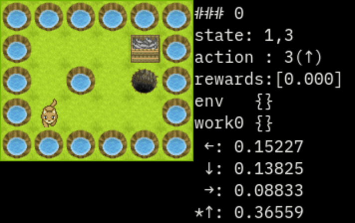

.. _custom_algorithm:

=========================
Making a Custom algorithm
=========================

ここでは本フレームワークの自作アルゴリズムを作成する方法を説明します。

+ 1.概要  
+ 2.実装するクラス  
   + 2-1.Config
   + 2-2.Memory
   + 2-3.Parameter
   + 2-4.Trainer
   + 2-5.Worker
+ 3.自作アルゴリズムの登録
+ 4.型ヒント
+ 5.Q学習実装例

1. 概要
==========

| 自作アルゴリズムは5つのクラスが以下のように連携して動作します。
| ※図にはないですが、他にハイパーパラメータを管理するConfigクラスがあります
| ※WorkerRunとEnvRunはフレームワーク内の内容になるので意識する必要はありません

.. image:: ../../diagrams/overview-sequence.drawio.png

| 実装側で意識する疑似コードは以下です。

.. code-block:: python

   # 学習単位の初期化
   parameter.setup()
   memory.setup()
   worker.on_setup()
   trainer.on_setup()

   for episode in range(N)
      # 1エピソード最初の初期化
      env.reset()
      worker.on_reset()

      # 1エピソードのループ
      while not env.done:
            # アクションを取得
            action = worker.policy()
            worker.render()  # workerの描画

            # 環境の1stepを実行
            env.step(action)
            worker.on_step()

            # 学習
            trainer.train()

      # 終了後の描画
      worker.render()

   # 学習単位の終了
   worker.on_teardown()
   trainer.on_teardown()

| それぞれの役割は以下です。

.. list-table::
   :widths: 8 30
   :header-rows: 0

   * - Config
     - + ハイパーパラメータを管理
       + 実行時のSpace情報を管理
   * - Memory
     - + Workerが収集したサンプルを管理
   * - Parameter
     - + 学習パラメータを保持
   * - Trainer
     - + Memoryからサンプルを取得し学習する
       + 学習後、Parameterを更新する
   * - Worker
     - + Environmentと連携しサンプルを収集
       + 収集したサンプルをMemoryに送信
       + 行動決定に必要な情報をParameterから読む

分散学習は以下となり各クラスが非同期で動作します。

・MemoryとTrainerが非同期

.. image:: ../../diagrams/overview-mp_memory.drawio.png

・MemoryとTrainerが同期

.. image:: ../../diagrams/overview-mp.drawio.png

同期的な学習と以下の点が異なります。  

+ WorkerがMemoryにサンプルを送るタイミングとTrainerが取り出すタイミングが異なる
+ ParameterがWorkerとTrainerで別インスタンス

各クラスの実装の仕方を見ていきます。

2. 実装する各クラスの説明
================================

2-1. Config
--------------------------------------------

| 強化学習アルゴリズムの種類やハイパーパラメータを管理するクラスです。  
| 基底クラスは `srl.base.rl.base.RLConfig` でこれを継承して作成します。  
| 
| RLConfig で実装が必要な関数・プロパティは以下です。  

.. code-block:: python

   from dataclasses import dataclass
   from srl.base.rl.config import RLConfig
   from srl.base.define import RLBaseActTypes, RLBaseObsTypes
   from srl.base.rl.processor import Processor

   # 必ず dataclass で書いてください
   @dataclass
   class MyConfig(RLConfig):

      # 任意のハイパーパラメータを定義
      hoo_param: float = 0
      bar_param: float = 0
      
      def get_name(self) -> str:
         """ ユニークな名前を返す """
         raise NotImplementedError()

      def get_base_action_type(self) -> RLBaseActTypes:
         """
         アルゴリズムが想定するアクションのタイプ(srl.base.define.RLBaseActTypes)を返してください。
         """
         raise NotImplementedError()

      def get_base_observation_type(self) -> RLBaseObsTypes:
         """
         アルゴリズムが想定する環境から受け取る状態のタイプ(srl.base.define.RLBaseObsTypes)を返してください。
         """
         raise NotImplementedError()

      # ------------------------------------
      # 以下は option です。（なくても問題ありません）
      # ------------------------------------
      def get_framework(self) -> str:
         """
         使うフレームワークを指定してください。
         return ""           : なし(default)
         return "tensorflow" : Tensorflow
         return "torch"      : Torch
         """
         raise NotImplementedError()

      def validate_params(self) -> None:
         """ パラメータのassertを記載 """
         super().validate_params()  # 定義する場合は親クラスも呼び出してください

      def setup_from_env(self, env: EnvRun) -> None:
         """ env初期化後に呼び出されます。env関係の初期化がある場合は記載してください。 """
         pass
         
      def setup_from_actor(self, actor_num: int, actor_id: int) -> None:
         """ 分散学習でactorが指定されたときに呼び出されます。Actor関係の初期化がある場合は記載してください。 """
         pass

      def get_processors(self, prev_observation_space: SpaceBase) -> List[RLProcessor]:
         """ 前処理を追加したい場合設定してください """
         return []

      def use_backup_restore(self) -> bool:
         """ MCTSなど、envのbackup/restoreを使う場合はTrueを返してください"""
         return False

      # use_render_image_stateをTrueにするとworker.render_img_stateが有効になります
      # これはenv.render_rgb_arrayの画像が入ります
      def use_render_image_state(self) -> bool:
         return False
      def get_render_image_processors(self, prev_observation_space: SpaceBase) -> List[RLProcessor]:
         """render_img_stateに対する前処理"""
         return []

※ __post_init__ の利用はコンストラクタの値が上書きされるので非推奨です。

2-2. Memory
--------------------------------------------

| Workerが取得したサンプル(batch)をTrainerに渡す役割を持っているクラスです。
| 以下の3種類から継承すると簡単です。

.. list-table::
   :widths: 15 30
   :header-rows: 0

   * - SingleUseBuffer
     - 来たサンプルを順序通りに取り出します。(Queueみたいな動作です)
   * - ReplayBuffer
     - サンプルをランダムに取り出します。
   * - PriorityReplayBuffer
     - サンプルを優先順位に従い取り出します。

RLSingleUseBuffer
^^^^^^^^^^^^^^^^^^^^^^^^^^

順番通りにサンプルを取り出しますMemoryです。サンプルは取り出すとなくなります。

.. literalinclude:: custom_algorithm1.py

RLReplayBuffer
^^^^^^^^^^^^^^^^^^^^^^^^^^

| ランダムにサンプルを取り出すMemoryです。
| これを使う場合は Configに `batch_size` と `ReplayBufferConfig` を実装する必要があります。

.. literalinclude:: custom_algorithm2.py

RLPriorityReplayBuffer
^^^^^^^^^^^^^^^^^^^^^^^^^^

| 優先順位に従ってサンプルを取り出すMemoryです。
| これを使う場合は Configに `batch_size` と `PriorityReplayBufferConfig` を実装する必要があります。
| また、このアルゴリズムはConfigのset関数により切り替えることができます。

.. list-table::
   :widths: 15 50
   :header-rows: 1

   * - クラス名
     - 説明
   * - set_replay_buffer
     - ReplayBufferと同じで、ランダムに取得します。（優先順位はありません）
   * - set_proportional
     - サンプルの重要度によって確率が変わります。重要度が高いサンプルほど選ばれる確率が上がります。
   * - set_rankbased
     - サンプルの重要度のランキングによって確率が変わります。重要度が高いサンプルほど選ばれる確率が上がるのはProportionalと同じです。
   * - set_rankbased_linear
     - rankbasedと同じですが、指数的な計算で複雑なrankbasedをlinearを仮定することで高速化したアルゴリズムです。

.. literalinclude:: custom_algorithm3.py

オリジナルMemoryの作成
^^^^^^^^^^^^^^^^^^^^^^^^^^

| RLMemoryを継承して実装します。
| 実装後にWorker/Trainerとやり取りする関数を登録します。

.. list-table::
   :widths: 15 30
   :header-rows: 0

   * - register_worker_func
     - Worker -> Memory の関数を登録します。
   * - register_trainer_recv_func
     - Memory -> Trainer の関数を登録します。
   * - register_trainer_send_func
     - Trainer -> Memory の関数を登録します。

.. code-block:: python

   from srl.base.rl.memory import RLMemory

   import numpy as np

   class MyMemory(RLMemory):
      def setup(self) -> None:
         # self.config に上で定義した MyConfig が入っています

         # Worker -> Memory用の関数を登録、同時にシリアライズ用の関数も指定する必要あり
         self.register_worker_func(self.add, self.serialize)

         # Memory -> Trainer用の関数を登録
         self.register_trainer_recv_func(self.sample)

         # Trainer -> Memory用の関数を登録
         self.register_trainer_send_func(self.update)

      def add(self, batch, serialized: bool = False) -> None:
         # Worker->Memory関数は引数に serialized を持つ必要があり、
         #   Trueの場合、シリアライズされたデータになっている。
         if serialized:
            batch = pickle.loads(batch)  # デシリアライズ例

      def serialize(self, batch):
         # Worker->Memoryのデータをシリアライズする関数
         return pickle.dumps(batch)  # シリアライズ例

      def sample(self) -> Any:
         # 引数はなし
         raise NotImplementedError()

      def update(self, batch) -> None:
         raise NotImplementedError()

      # オプションですが、定義すると表示してくれます。
      def length(self) -> int:
         return -1

      # call_restore/call_backupでパラメータが復元できるように作成
      def call_restore(self, data, **kwargs) -> None:
         raise NotImplementedError()
      def call_backup(self, **kwargs):
         raise NotImplementedError()

      # その他任意の関数を作成できます。

※ v0.19.0 より `__init__` の使用は非推奨となりました。代わりにsetupを使ってください。  

2-3. Parameter
--------------------------------------------

| パラメータを管理するクラスです。
| 深層学習の場合はここにニューラルネットワークを定義することを想定しています。

.. code-block:: python

   from srl.base.rl.parameter import RLParameter

   import numpy as np

   class MyParameter(RLParameter):
      def setup(self):
         # self.config に上で定義した MyConfig が入っています
         pass

      # call_restore/call_backupでパラメータが復元できるように作成
      def call_restore(self, data, **kwargs) -> None:
         raise NotImplementedError()
      def call_backup(self, **kwargs):
         raise NotImplementedError()

      # その他任意の関数を作成できます。
      # 分散学習ではTrainer/Worker間で値を保持できない点に注意（backup/restoreした値のみ共有されます）

※ v0.19.0 より `__init__` の使用は非推奨となりました。代わりにsetupを使ってください。  

2-4. Trainer
--------------------------

| 学習を定義する部分です。
| Memoryから経験を受け取ってParameterを更新します。  

.. code-block:: python

   from srl.base.rl.trainer import RLTrainer

   class MyTrainer(RLTrainer):
      def on_setup(self) -> None:
         # 以下の変数を持ちます。
         # self.config: MyConfig
         # self.parameter: MyParameter
         # self.memory: MyMemory
         #
         # 他にも以下のプロパティが使えます
         # self.distributed  - property, bool : 分散実行中かどうかを返します
         # self.train_only   - property, bool : 学習のみかどうかを返します
         #
         pass

      def train(self) -> None:
         """
         self.memory から batch を受け取り学習する事を想定しています。
         
         ・学習したら回数を数えてください
         self.train_count += 1

         ・(option)必要に応じてinfoを設定します
         self.info = {"loss": 0.0}
         """
         raise NotImplementedError()
      
※ v0.19.0 より `__init__` の使用は非推奨となりました。代わりにon_setupを使ってください。  

2-5. Worker
--------------------------------------------

| 実際に環境と連携して経験を収集するクラスです。
| 役割は、Parameterを参照してアクションを決める事と、サンプルをMemoryに送信する事です。

フローをすごく簡単に書くと以下です。

.. code-block:: python

   env.reset()
   worker.on_reset()
   while:
      action = worker.policy()
      env.step(action)
      worker.on_step()
      trainer.train()

.. code-block:: python

   from srl.base.rl.worker import RLWorker
   from srl.base.rl.worker_run import WorkerRun

   class MyWorker(RLWorker):
      def on_setup(self, worker: WorkerRun, context: RunContext) -> None:
         # 以下の変数を持ちます。
         # self.config: MyConfig
         # self.parameter: MyParameter
         # self.memory: MyMemory
         pass

      def on_teardown(self, worker) -> None:
         pass

      def on_reset(self, worker: WorkerRun):
         """ エピソードの最初に呼ばれる関数 """
         raise NotImplementedError()

      def policy(self, worker: WorkerRun) -> RLActionType:
         """ このターンで実行するアクションを返す関数、この関数のみ実装が必須になります

         Returns:
               RLActionType : 実行するアクション
         """
         raise NotImplementedError()

      def on_step(self, worker: WorkerRun):
         """ Envが1step実行した後に呼ばれる関数 """
         raise NotImplementedError()

      def render_terminal(self, worker, **kwargs) -> None:
         """ 
         描画用の関数です。
         実装するとrenderによる描画が可能になります。
         """
         pass

      def render_rgb_array(self, worker, **kwargs) -> Optional[np.ndarray]:
         """ 
         描画用の関数です。
         実装するとrenderによる描画が可能になります。
         """
         return None

   # --- 実装時に関数内で使う事を想定しているプロパティ・関数となります
   self.training     # property, bool : training かどうかを返します
   self.distributed  # property, bool : 分散実行中かどうかを返します
   self.rendering    # property, bool : renderがあるエピソードかどうかを返します
   self.observation_space     # property , SpaceBase : RLWorkerが受け取るobservation_spaceを返します
   self.action_space          # property , SpaceBase : RLWorkerが受け取るaction_spaceを返します
   self.get_invalid_actions() # function , List[RLAction] : 有効でないアクションを返します(離散限定)
   self.sample_action()       # function , RLAction : ランダムなアクションを返します

| ※v0.15.0からRLWorkerを直接継承する方法に変更しました
| ※v0.16.0からInfoが戻り値ではなく、内部変数になりました
| ※v0.19.0 より `__init__` の使用は非推奨となりました。代わりにon_setupを使ってください。  
| 
| 各種情報は WorkerRun から取り出して使います。
| 情報の例は以下です。

.. code-block:: python

   class MyWorker(RLWorker):
      def on_reset(self, worker):
         worker.state           # 初期状態
         worker.player_index    # 初期プレイヤーのindex
         worker.invalid_actions # 初期有効ではないアクションリスト

      def policy(self, worker) :
         worker.state           # 状態
         worker.player_index    # プレイヤーのindex
         worker.invalid_actions # 有効ではないアクションリスト

      def on_step(self, worker: "WorkerRun") -> dict:
         worker.state           # policy時のworker.state
         worker.next_state      # step後の状態
         worker.action          # policyで返したアクション
         worker.reward          # step後の即時報酬
         worker.done            # step後に終了フラグが立ったか
         worker.terminated      # step後にenvが終了フラグを立てたか
         worker.player_index    # 次のプレイヤーのindex
         worker.invalid_action       # policy時のworker.invalid_action
         worker.next_invalid_actions # step後の有効ではないアクションリスト

      def render_terminal(self, worker):  # 及び render_rgb_array
         # policy -> render -> env.step -> on_step -> policy
         # 想定する役割は、policy直後の状態の表示 + 前の状態の結果を表示
         worker.state           # policy時の状態
         worker.prev_state      # policy時の1つ前の状態
         worker.action          # policyで返したアクション
         worker.player_index    # プレイヤーのindex
         worker.invalid_actions       # policy時の有効ではないアクションリスト
         worker.prev_invalid_actions  # policy時の1つ前の有効ではないアクションリスト

| ※v0.19.0 より on_step 内の prev_state/state → state/next_state に変更になりました

3. 自作アルゴリズムの登録
=========================

| 以下で登録します。  
| 第2引数以降の entry_point は、`モジュールパス + ":" + クラス名`で、  
| モジュールパスは `importlib.import_module` で呼び出せる形式である必要があります。

.. code-block:: python

   from srl.base.rl.registration import register
   register(
      MyConfig(),
      __name__ + ":MyMemory",
      __name__ + ":MyParameter",
      __name__ + ":MyTrainer",
      __name__ + ":MyWorker",
   )

4. 型ヒント
=========================

| 動作に影響ないですが、可能な限り型ヒントが表示されるようにしています。
| ※VSCodeを想定しています
| RLConfigとRLWorkerはimport先を変えることで型アノテーションが指定された状態になります。

.. code-block:: python
   
   # from srl.rl.config import RLConfig
   # from srl.rl.worker import RLWorker
   # ↓
   from srl.base.rl.algorithms.base_dqn import RLConfig, RLWorker

   # srl.base.rl.algorithms.base_XX の XX の部分を変更する事でアルゴリズムに合った型に変更できます
   # XX の種類についてはソースコードを見てください。

また、ジェネリック型を追加する事で各クラスの型を追加できます。

.. code-block:: python

   # RLMemory[TConfig]
   #   TConfig : RLConfigを継承したクラス
   class Memoryr(RLMemory[Config]):
      pass

   # RLParameter[TConfig]
   #   TConfig : RLConfigを継承したクラス
   class Parameter(RLParameter[Config]):
      pass

   # RLTrainer[TConfig, TParameter, TMemory]
   #   TConfig    : RLConfigを継承したクラス
   #   TParameter : RLParameterを継承したクラス
   #   TMemory    : RLMemoryを継承したクラス
   class Trainer(RLTrainer[Config, Parameter, Memory]):
      pass

   # RLWorker[TConfig, TParameter]
   #   TConfig    : RLConfigを継承したクラス
   #   TParameter : RLParameterを継承したクラス
   #   TMemory    : RLMemoryを継承したクラス
   class Worker(RLWorker[Config, Parameter, Memory]):
      pass

5. 実装例(Q学習)
=================

.. literalinclude:: custom_algorithm4.py

renderの表示例

.. code-block:: text

   100エピソードの平均結果 0.7347999999999999
   ......
   .   G.
   . . X.
   .P   .
   ......

   ←: 0.15227
   ↓: 0.13825
   →: 0.08833
   *↑: 0.36559
   ### 0
   state: 1,3
   action : 3(↑)
   rewards:[0.000]
   env   {}
   work0 {}
   ......
   .   G.
   .P. X.
   .S   .
   ......

   ←: 0.24042
   ↓: 0.17950
   →: 0.23959
   *↑: 0.48550
   ### 1
   state: 1,2
   action : 3(↑)
   rewards:[-0.040]
   env   {}
   work0 {}
   ......
   .P  G.
   . . X.
   .S   .
   ......

   ←: 0.30830
   ↓: 0.25582
   *→: 0.60909
   ↑: 0.31496
   ### 2
   state: 1,1
   action : 2(→)
   rewards:[-0.040]
   env   {}
   work0 {}
   ......
   .P  G.
   . . X.
   .S   .
   ......

   ←: 0.30830
   ↓: 0.25582
   *→: 0.60909
   ↑: 0.31496
   ### 3
   state: 1,1
   action : 2(→)
   rewards:[-0.040]
   env   {}
   work0 {}
   ......
   .   G.
   .P. X.
   .S   .
   ......

   ←: 0.24042
   ↓: 0.17950
   →: 0.23959
   *↑: 0.48550
   ### 4
   state: 1,2
   action : 3(↑)
   rewards:[-0.040]
   env   {}
   work0 {}
   ......
   .   G.
   .P. X.
   .S   .
   ......

   ←: 0.24042
   ↓: 0.17950
   →: 0.23959
   *↑: 0.48550
   ### 5
   state: 1,2
   action : 3(↑)
   rewards:[-0.040]
   env   {}
   work0 {}
   ......
   .P  G.
   . . X.
   .S   .
   ......

   ←: 0.30830
   ↓: 0.25582
   *→: 0.60909
   ↑: 0.31496
   ### 6
   state: 1,1
   action : 2(→)
   rewards:[-0.040]
   env   {}
   work0 {}
   ......
   .P  G.
   . . X.
   .S   .
   ......

   ←: 0.30830
   ↓: 0.25582
   *→: 0.60909
   ↑: 0.31496
   ### 7
   state: 1,1
   action : 2(→)
   rewards:[-0.040]
   env   {}
   work0 {}
   ......
   . P G.
   . . X.
   .S   .
   ......

   ←: 0.33411
   ↓: 0.40200
   *→: 0.76411
   ↑: 0.41102
   ### 8
   state: 2,1
   action : 2(→)
   rewards:[-0.040]
   env   {}
   work0 {}
   ......
   .  PG.
   . . X.
   .S   .
   ......

   ←: 0.42417
   ↓: 0.36094
   *→: 0.92805
   ↑: 0.54881
   ### 9
   state: 3,1
   action : 2(→)
   rewards:[-0.040]
   env   {}
   work0 {}
   ......
   .   P.
   . . X.
   .S   .
   ......

   ←: 0.42417
   ↓: 0.36094
   *→: 0.92805
   ↑: 0.54881
   ### 10, done()
   state: 4,1
   action : 2(→)
   rewards:[1.000]
   env   {}
   work0 {}

