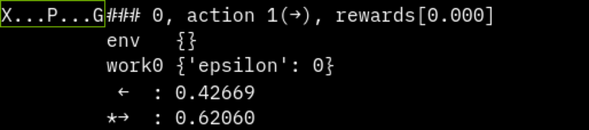

.. _custom_env:

===========================
Make Original Environment
===========================

ここでは本フレームワークでの自作環境を作成する方法を説明します。  

+ 1.環境クラスの実装
   + 1-1.Gymクラスによる実装
   + 1-2.EnvBaseクラスによる実装
      + 一人プレイ環境の実装
      + ターン制二人プレイ環境の実装
+ 2.Spaceクラスの説明
+ 3.登録
+ 4.実装例
+ 5.Q学習による学習例

1. 環境クラスの実装
=====================

自作環境を作成する方法は大きく二つあります。

+ `Gym <https://github.com/openai/gym>`_ または `Gymnasium <https://github.com/Farama-Foundation/Gymnasium>`_ （以下Gym）の環境を用意する
+ 本フレームワークで実装されている 'srl.base.env.EnvBase' を継承する

それぞれについて説明します。

1-1. Gymクラスによる実装
--------------------------------------------

| Gymの環境を利用を利用する場合は別途 `pip install gymnasium` が必要です。
| ただ、Gym環境を利用する場合、一部本フレームワークに特化した内容にはならない点には注意してください。
| ある程度自動で予測していますが、状態やアクションが連続か離散か等、学習に必要な情報が増えており、その予測が間違う可能性があります。
| 
| ※Gym側の更新等により不正確な情報になる可能性があります。より正確な情報は公式(https://github.com/Farama-Foundation/Gymnasium)を見てください。
  
Gym環境の実装例は以下です。  

.. code-block:: python

   import gymnasium as gym
   from gymnasium import spaces
   import numpy as np

   class MyGymEnv(gym.Env):
      # 利用できるrender_modesを指定
      metadata = {"render_modes": ["ansi", "rgb_array"], "render_fps": 4}
      
      def __init__(self, render_mode: str | None = None):
         self.render_mode = render_mode
         """
         initで以下2つの変数を定義する必要あり
         spaces.Space型については省略します。
         
         self.action_space      : アクションが取りうる範囲を指定
         self.observation_space : 状態が取りうる範囲を指定
         """
         
         self.action_space: spaces.Space = spaces.Discrete(2)
         self.observation_space: spaces.Space = spaces.Box(-1, 1, shape=(1,))

      def reset(self, *, seed=None, options=None)-> tuple[np.ndarray, dict]:
         super().reset(seed=seed)
         """ 1エピソードの最初に実行。（初期化処理を実装）
         return 初期状態, 情報
         """
         return np.array([0], dtype=np.float32), {}
      
      def step(self, action) -> tuple[np.ndarray, float, bool, bool, dict]:
         """ actionを元に1step進める処理を実装
         return (
               1step後の状態,
               即時報酬,
               予定通り終了したらTrue(terminated),
               予想外で終了したらTrue(truncated),
               情報(任意),
         )
         """
         return np.array([0], dtype=np.float32), 0.0, True, False, {}

      def render(self):
         """
         描画処理を書きます。
         """
         pass

| 環境クラスを作成したら登録します。
| 登録時のid名は "名前-vX" という形式である必要があります。

.. code-block:: python

   import gymnasium.envs.registration

   gymnasium.envs.registration.register(
      id="MyGymEnv-v0",
      entry_point=__name__ + ":MyGymEnv",
      max_episode_steps=10,
   )

以下のように呼び出せます。

.. code-block:: python

   import gymnasium as gym
   env = gym.make("MyGymEnv-v0")

   observation = env.reset()

   for _ in range(10):
      observation, reward, terminated, truncated, info = env.step(env.action_space.sample())
      env.render()

      if terminated or truncated:
         observation = env.reset()

   env.close()

Gym環境の実装に本フレームワークの実装を追加する方法
---------------------------------------------------

| Gym環境を実装したクラスに以下の関数を追加すると本フレームワークが認識します。
| （本フレームワークのバージョンにより対応する項目は追加・変更する可能性があります）

.. code-block:: python

   class MyGymEnv(gym.Env):

      def setup(self, **kwargs):
         """ srlのrunnerで、train等の実行単位の最初に呼ばれる関数 """
         pass

      # backup/restore機能が追加されます
      def backup(self) -> Any:
         return data
      def restore(self, data: Any) -> None:
         pass

      def get_invalid_actions(self, player_index: int = -1) -> list[int]:
         """ 有効でないアクションのリストを指定できます。これはアクションがintの場合のみ有効です """
         return []

      def action_to_str(self, action) -> str:
         """ アクションの文字列を実装します。これは主に描画関係で使われます """
         return str(action)

      def get_key_bind(self) -> Optional[KeyBindType]:
         """ 手動入力時のキーのマップを指定できます """
         return None

1-2. EnvBaseクラスによる実装
--------------------------------------------

| 本フレームワーク共通で使用する基底クラス(`srl.base.env.EnvBase`)の説明です。
| 本フレームワークの環境はこのクラスを継承している必要があります。
| 
| ただこれは、複数人のプレイ環境も実装できるように実装しているので、特定の環境にとっては余分な情報があります。
| 環境の構成が以下に合う場合は、別途特化したクラス継承しする事で手間が減ります。

+ EnvBase         : 0から環境を作る場合に継承するクラス
+ SinglePlayEnv   : 一人用の環境を作る場合に継承するクラス
+ TurnBase2Player : 二人用ターン制の環境を作る場合に継承するクラス

以下、継承した後に実装が必要な関数・プロパティです。

EnvBase
^^^^^^^^^^^^^^^^^^

.. code-block:: python

   from typing import Any
   from srl.base.env import EnvBase
   from srl.base.spaces.space import SpaceBase
   from srl.base.define import EnvActionType, EnvObservationType, EnvObservationTypes

   class MyEnvBase(EnvBase):

      @property
      def action_space(self) -> SpaceBase:
         """ アクションの取りうる範囲を返します(SpaceBaseは後述) """
         raise NotImplementedError()

      @property
      def observation_space(self) -> SpaceBase:
         """ 状態の取りうる範囲を返します(SpaceBaseは後述) """
         raise NotImplementedError()

      @property
      def max_episode_steps(self) -> int:
         """ 1エピソードの最大ステップ数 """
         raise NotImplementedError()

      @property
      def player_num(self) -> int:
         """ プレイヤー人数 """
         raise NotImplementedError()

      def reset(self) -> tuple[EnvObservationType, dict]:
         """ 1エピソードの最初に実行。（初期化処理を実装）
         Returns: (
               init_state : 初期状態
               info       : 任意の情報
         )
         """
         raise NotImplementedError()

      def step(self, action: EnvActionType) -> tuple[EnvObservationType, list[float], bool, dict]:
         """ actionとplayerを元に1step進める処理を実装

         Args:
               action (EnvAction): player_index action

         Returns: (
               next_state : 1step後の状態
               [
                  player1 reward,  : player1の報酬
                  player2 reward,  : player2の報酬
                  ...
               ],
               done,  : episodeが終了したか
               info,  : 任意の情報
         )
         """
         raise NotImplementedError()

      @property
      def next_player_index(self) -> int:
         """ 次のプレイヤーindex """
         raise NotImplementedError()

一人プレイ環境
^^^^^^^^^^^^^^^^^^

.. code-block:: python

   from typing import Any

   from srl.base.env.genre import SinglePlayEnv
   from srl.base.spaces.space import SpaceBase
   from srl.base.define import EnvObservationTypes

   class MySinglePlayEnv(SinglePlayEnv):

      @property
      def action_space(self) -> SpaceBase:
         """ アクションの取りうる範囲を返します(SpaceBaseは後述) """
         raise NotImplementedError()

      @property
      def observation_space(self) -> SpaceBase:
         """ 状態の取りうる範囲を返します(SpaceBaseは後述) """
         raise NotImplementedError()

      @property
      def max_episode_steps(self) -> int:
         """ 1エピソードの最大ステップ数 """
         raise NotImplementedError()

      def call_reset(self) -> tuple[EnvObservationType, dict]:
         """ 1エピソードの最初に実行。（初期化処理を実装）
         Returns: (
               EnvObservation (observation_spaceの型): 初期状態
               Info                                 : 任意の情報
         )
         """
         raise NotImplementedError()

      def call_step(self, action) -> tuple[EnvObservationType, float, bool, dict]:
         """ actionを元に1step進める処理を実装
         Returns: (
               next_state : 1step後の状態
               reward     : 即時報酬
               done       : 終了したかどうか
               info       : 任意の情報
         )
         """
         raise NotImplementedError()

ターン制二人プレイ環境
^^^^^^^^^^^^^^^^^^^^^^^^^^

.. code-block:: python

   from typing import Any

   from srl.base.env.genre import TurnBase2Player
   from srl.base.spaces.space import SpaceBase
   from srl.base.define import EnvObservationTypes

   class MyTurnBase2Player(TurnBase2Player):

      @property
      def action_space(self) -> SpaceBase:
         """ アクションの取りうる範囲を返します(SpaceBaseは後述) """
         raise NotImplementedError()

      @property
      def observation_space(self) -> SpaceBase:
         """ 状態の取りうる範囲を返します(SpaceBaseは後述) """
         raise NotImplementedError()

      @property
      def max_episode_steps(self) -> int:
         """ 1エピソードの最大ステップ数 """
         raise NotImplementedError()

      @property
      def next_player_index(self) -> int:
         """ 次ターンのプレイヤー番号を返す """
         raise NotImplementedError()

      def call_reset(self) -> tuple[EnvObservationType, dict]:
         """ 1エピソードの最初に実行。（初期化処理を実装）
         Returns: (
               EnvObservation (observation_spaceの型): 初期状態
               Info                                 : 任意の情報
         )
         """
         raise NotImplementedError()

      def call_step(self, action) -> tuple[EnvObservationType, float, float, bool, dict]:
         """ action を元に1step進める処理を実装
         Returns: (
               next_state     : 1step後の状態
               player1 reward : player1の即時報酬
               player2 reward : player2の即時報酬
               done       : 終了したかどうか
               info       : 情報(任意)
         )
         """
         raise NotImplementedError()

その他のオプション
^^^^^^^^^^^^^^^^^^^^^

必須ではないですが、設定できる関数・プロパティとなります。

.. code-block:: python

   def setup(self, **kwargs):
      """ srlのrunnerで、train等の実行単位の最初に呼ばれる関数 
      引数 kwargs は `srl.base.run.context.RunContext` の変数が入ります """
      pass

   # backup/restore で現環境を復元できるように実装
   # MCTS等のアルゴリズムで使用します
   def backup(self) -> Any:
      raise NotImplementedError()
   def restore(self, data: Any) -> None:
      raise NotImplementedError()

   # --- 追加情報
   @property
   def reward_info(self) -> dict:
      """ 報酬に関する情報を返す """
      return {
         "min": None,
         "max": None,
         "baseline": None,
      }

   # --- 実行に関する関数
   def close(self) -> None:
      """ 終了処理を実装 """
      pass
   
   def get_invalid_actions(self, player_index: int) -> list:
      """ 無効なアクションがある場合は配列で返す
      （SinglePlayEnv では call_get_invalid_actions で設定）
      """
      return []

   def set_seed(self, seed: Optional[int] = None) -> None:
      """ 乱数のseedを設定 """
      pass

   # --- AI
   def make_worker(self, name: str) -> Optional["srl.base.rl.base.WorkerBase"]:
      """ 環境に特化したAIを返す """
      return None

   # --- 描画に関する関数
   def render_terminal(self, **kwargs) -> None:
      """ 現在の状況をprintで表示する用に実装 """
      pass

   def render_rgb_array(self, **kwargs) -> np.ndarray | None:
      """ 現在の状況を RGB の画像配列で返す """
      return None

   def action_to_str(self, action: Union[str, EnvActionType]) -> str:
      """ アクションを文字列に変換する """
      return str(action)

   @property
   def render_interval(self) -> float:
      """ 描画速度を返す """
      return 1000 / 60

   # --- プレイ時に関する関数
   def get_key_bind(self) -> KeyBindType:
      """ キー配置とアクションを紐づける """
      return None

2. Spaceクラスについて
=================================

Spaceクラスは、アクション・状態の取りうる範囲を決めるクラスで以下となります。

.. list-table::
   :header-rows: 1

   * - SpaceClass
     - 型
     - 概要
   * - DiscreteSpace
     - int
     - 1つの整数を表します。
       例えば DiscreteSpace(5) とした場合、0～4 の値を取ります。
   * -  ArrayDiscreteSpace
     - list[int]
     - 整数の配列を取ります。
       例えば ArrayDiscreteSpace(3, low=-1, high=2) とした場合、[-1, 1, 0] や [2, 1, -1] 等の値を取ります。
   * - ContinuousSpace
     - float
     - 1つの小数を表します。
       例えば ContinuousSpace(low=-1, high=1) とした場合、-1～1 の値を取ります。
   * - ArrayContinuousSpace
     - list[float]
     - 小数の配列を取ります。
       例えば ArrayContinuousSpace(3, low=-1, high=1) とした場合、[0.1, -0.5, 0.9] 等の値を取ります。
   * - BoxSpace
     - NDArray
     - numpy配列を指定の範囲内で取り扱います。
       例えば BoxSpace(shape=(1, 2), low=-1, high=1) とした場合、[[-0.1, 1.0]] や [[0.1, 0.2] 等の値を取ります。

| BoxSpaceはコンストラクタでstypeを指定できます。
| stypeはアルゴリズム側が認識する型となり、以下があります。

.. list-table::
    :header-rows: 1

    * - SpaceTypes
      - 内容
      - shape
    * - DISCRETE
      - 離散
      - 
    * - CONTINUOUS
      - 連続
      - 
    * - GRAY_2ch
      - グレー画像(2ch)
      - (height, width)
    * - GRAY_3ch
      - グレー画像(3ch)
      - (height, width, 1)
    * - COLOR
      - カラー画像(3ch)
      - (height, width, 3)
    * - IMAGE
      - 画像形式
      - (height, width, N)

| 例えば `BoxSpace((64,64,3), stype=SpaceTypes.COLOR)` とすればカラー画像になります。
| 詳細はコード `srl.base.env.spaces`、 `srl.base.define` を見てください。

3. 自作環境の登録
====================

作成した環境は以下で登録します。

.. list-table::
    :header-rows: 1

    * - 引数
      - 説明
      - 備考
    * - id
      - ユニークな名前
      - 被らなければ特に制限はありません
    * - entry_point
      - `モジュールパス + ":" + クラス名`
      - モジュールパスは `importlib.import_module` で呼び出せる形式である必要があります
    * - kwargs
      - クラス生成時の引数
      - 

.. code-block:: python

   from srl.base.env import registration

   registration.register(
      id="SampleEnv",
      entry_point=__name__ + ":SampleEnv",
      kwargs={},
   )

4. 実装例
====================

左右に動け、左が穴、右がゴールなシンプルな環境を実装します。

.. literalinclude:: ../../srl/envs/sample_env.py

実装した環境を動かすコード例は以下です。

**Runnerで実行する場合**

.. literalinclude:: custom_env12.py

**関数を呼び出して直接実行する場合**

.. literalinclude:: custom_env1.py

テスト
----------------

最低限ですが、ちゃんと動くか以下でテストできます。

.. literalinclude:: custom_env2.py

5. Q学習による学習例
=======================

.. literalinclude:: custom_env3.py

