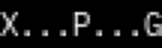

.. _custom_env:

=============================
Making a Custom environment
=============================

ここでは本フレームワークの環境を作成する方法を説明します。  

+ 1.環境クラスの実装
   + 1-1.Gymクラスによる実装
   + 1-2.EnvBaseクラスによる実装
   + 1-3.追加オプション
+ 2.Spaceクラスの説明
+ 3.登録
+ 4.実装例
+ 5.Q学習による学習例

| **・外部環境との連携方法について**  
| `examples/external_env/ <https://github.com/pocokhc/simple_distributed_rl/tree/main/examples/external_env/>`_ 配下にサンプルコードがあります。  

1. 環境クラスの実装
=====================

| 自作環境を作成する方法は大きく二つあります。
| 
| 1-1. `Gym <https://github.com/openai/gym>`_ または `Gymnasium <https://github.com/Farama-Foundation/Gymnasium>`_ （以下Gym）の環境を用意する
| 1-2. 本フレームワークで実装されている 'srl.base.env.EnvBase' を継承する
| 
| どちらで作成しても問題ありません。  
| それぞれについて説明します。

1-1. Gymクラスによる実装
--------------------------------------------

| Gymの環境を利用を利用する場合は別途 `pip install gymnasium` が必要です。
| ただ、Gym環境を利用する場合、一部本フレームワークに特化した内容にはならない点には注意してください。
| ある程度自動で予測していますが、状態やアクションが連続か離散か等、学習に必要な情報が増えており、その予測が間違う可能性があります。
| 
| ※Gym側の更新等により不正確な情報になる可能性があります。より正確な情報は公式(https://github.com/Farama-Foundation/Gymnasium)を見てください。
  
Gym環境の実装例は以下です。  

.. code-block:: python

   import gymnasium as gym
   from gymnasium import spaces
   import numpy as np

   class MyGymEnv(gym.Env):
      # 利用できるrender_modesを指定
      metadata = {"render_modes": ["ansi", "rgb_array"], "render_fps": 4}
      
      # 環境の初期化
      #
      # 必ず以下の2つを定義する必要がある：
      # - action_space: 取りうる行動の空間
      # - observation_space: 観測（状態）の空間
      def __init__(self, render_mode: str | None = None):
         self.render_mode = render_mode
         self.action_space: spaces.Space = spaces.Discrete(2)
         self.observation_space: spaces.Space = spaces.Box(-1, 1, shape=(1,))

      # エピソード開始時の初期化処理
      # - 状態を初期値にリセット
      # - return (observation, info)
      def reset(self, *, seed=None, options=None)-> tuple[np.ndarray, dict]:
         super().reset(seed=seed)
         return np.array([0], dtype=np.float32), {}
      
      # actionを元に1step進める処理を実装
      # return (
      #   1step後の状態,
      #   即時報酬,
      #   予定通り終了したらTrue(terminated),
      #   予想外で終了したらTrue(truncated),
      #   情報(任意),
      # )
      def step(self, action) -> tuple[np.ndarray, float, bool, bool, dict]:
         return np.array([0], dtype=np.float32), 0.0, True, False, {}

      # 描画処理を記載
      def render(self):
         pass

| 環境クラスを作成したら登録します。
| 登録時のid名は "名前-vX" という形式である必要があります。

.. code-block:: python

   import gymnasium.envs.registration

   gymnasium.envs.registration.register(
      id="MyGymEnv-v0",
      entry_point=__name__ + ":MyGymEnv",
      max_episode_steps=10,
   )

以下のように呼び出せます。

.. code-block:: python

   import gymnasium as gym
   env = gym.make("MyGymEnv-v0")

   observation = env.reset()

   for _ in range(10):
      observation, reward, terminated, truncated, info = env.step(env.action_space.sample())
      env.render()

      if terminated or truncated:
         observation = env.reset()

   env.close()

| また、後述する追加オプションを実装するとSRL側で認識し使うことができます。

1-2. EnvBaseクラスによる実装
--------------------------------------------

※v0.17からSinglePlayEnv,TurnBase2Playerの実装は非推奨となりました。（コードは残してあります）

| 本フレームワーク共通で使用する基底クラス(`srl.base.env.EnvBase`)の説明です。
| 本フレームワークの環境はこのクラスを継承している必要があります。

以下、継承した後に実装が必要な関数・プロパティです。

EnvBase
^^^^^^^^^^^^^^^^^^

.. code-block:: python

   from typing import Any
   from srl.base.env import EnvBase
   from srl.base.spaces.space import SpaceBase
   from srl.base.define import EnvActionType, EnvObservationType, EnvObservationTypes

   # ※ @dataclass も使えます
   class MyEnvBase(EnvBase):

      # --- 内部で既に定義されている変数です
      #     reset, stepの関数内で適宜変えてください
      # self.next_player: int = 0   # これは複数プレイヤーがいる場合に次のプレイヤーのインデックスを代入する必要があります
      # self.done_reason: str = ""  # (option) 終了時の理由を残せます
      # self.info: Info = Info()    # (option) 辞書形式で各種情報を残せます

      # ※記載が必要
      def __init__():
         super().__init__()

      # ※dataclassの場合
      # def __post_init__():
      #    super().__init__()

      # アクションの取りうる範囲を記載(SpaceBaseは後述)
      @property
      def action_space(self) -> SpaceBase:
         raise NotImplementedError()

      # 状態の取りうる範囲を記載(SpaceBaseは後述)
      @property
      def observation_space(self) -> SpaceBase:
         raise NotImplementedError()

      # 1エピソードの最大ステップ数
      @property
      def max_episode_steps(self) -> int:
         raise NotImplementedError()

      # プレイヤー人数
      @property
      def player_num(self) -> int:
         raise NotImplementedError()
      
      # 1エピソードの最初に実行。（初期化処理を実装）
      #
      # Args:
      #   seed: 1エピソードの初期seed
      #
      # Returns:
      #   state: 初期状態
      #
      def reset(self, *, seed: Optional[int] = None, **kwargs) -> Any:
         raise NotImplementedError()

      # actionを元に1step進める処理を実装
      #
      # Args:
      #   action: 次のプレイヤーのアクション
      #
      # Returns:
      #   state     : 1step後の状態
      #   rewards   : プレイヤーが1人の場合は float、複数の場合は人数分の報酬を配列で返す
      #   terminated: MDP環境内で正常に終了した場合Trueを返す。これは一般的な環境の終了（ゴールしたや穴に落ちた等）
      #   truncated : MDP環境外で終了した場合Trueを返す。これは例外終了やタイムアップ等の異常な終了を表す。
      #
      def step(self, action) -> tuple[Any, float | list[float], bool, bool]:
         raise NotImplementedError()

      # 現在の状況をprintで実装(option)
      def render_terminal(self, **kwargs) -> None:
         pass
      
      # 現在の状況を RGB の画像配列で返す(option)
      def render_rgb_array(self, **kwargs) -> np.ndarray | None:
         return None

      # 描画速度(option)
      @property
      def render_interval(self) -> float:
         return 1000 / 60
         

1-3. 追加オプション
--------------------------------------------

| 必須ではないですが、追加で設定できる関数・プロパティとなります。
| （Gym環境の実装でも認識して使うことができます）
| （本フレームワークのバージョンにより対応する項目は追加・変更する可能性があります）

.. code-block:: python

   # ----------------------------
   # 動作に関するオプション
   # ----------------------------

   # run実行時の最初に呼ばれます。
   # 引数 kwargs は `srl.base.run.context.RunContext` の変数が入り、
   # Context情報で設定を変えて初期化したい場合に実装します。
   def setup(self, **kwargs):
      pass
   
   # 終了時に呼ばれます
   def close(self) -> None:
      pass
   
   # backup/restore で現環境を復元できるように実装。
   # MCTS等の一部アルゴリズムはこの実装がないと動作しません。
   def backup(self) -> Any:
      raise NotImplementedError()
   def restore(self, data: Any) -> None:
      raise NotImplementedError()

   # 毎step呼ばれます。
   # 無効なアクションがある場合に実装。
   def get_invalid_actions(self, player_index: int) -> list:
      return []
   
   # render_rgb_array の画像サイズ
   @property
   def render_image_shape(self) -> Optional[Tuple[int, int, int]]:
      return None

   # ----------------------------
   # その他オプション
   # ----------------------------
   
   # 表示名を変えたい場合に実装
   def get_display_name(self) -> str:
      return ""
   
   # アクションを表示できる文字列に変換
   def action_to_str(self, action: Union[str, EnvActionType]) -> str:
      return str(action)

   # プレイ時にアクションをキーボードと紐づける場合に実装
   def get_key_bind(self) -> KeyBindType:
      return None

   # 環境に特化したAIを返す場合に実装
   def make_worker(self, name: str) -> Optional["srl.base.rl.base.WorkerBase"]:
      return None

2. Spaceクラスについて
=================================

Spaceクラスは、アクション・状態の取りうる範囲を決めるクラスで以下となります。
SpaceTypesはフレームワーク内で定義されている値となります。(`srl.base.define.SpaceTypes`)

.. list-table::
   :header-rows: 1

   * - SpaceClass
     - 型
     - SpaceTypes
     - 概要
   * - DiscreteSpace
     - int
     - DISCRETE
     - 1つの整数を表します。
       例えば DiscreteSpace(5) とした場合、0～4 の値を取ります。
   * - ArrayDiscreteSpace
     - list[int]
     - DISCRETE
     - 整数の配列を取ります。
       例えば ArrayDiscreteSpace(3, low=-1, high=2) とした場合、[-1, 1, 0] や [2, 1, -1] 等の値を取ります。
   * - ContinuousSpace
     - float
     - CONTINUOUS
     - 1つの小数を表します。
       例えば ContinuousSpace(low=-1, high=1) とした場合、-1～1 の値を取ります。
   * - ArrayContinuousSpace
     - list[float]
     - CONTINUOUS
     - 小数の配列を取ります。
       例えば ArrayContinuousSpace(3, low=-1, high=1) とした場合、[0.1, -0.5, 0.9] 等の値を取ります。
   * - BoxSpace
     - NDArray[int]
     - DISCRETE
     - numpy配列を指定の範囲内で取り扱います。また、numpy配列が整数の値をとります。
   * - BoxSpace
     - NDArray[float]
     - CONTINUOUS
     - numpy配列を指定の範囲内で取り扱います。また、numpy配列が小数の値をとります。
   * - BoxSpace
     - NDArray[np.uint8]
     - GRAY_HW
     - グレー画像の形式を取り扱います。shapeは(height, width)を想定しています。
   * - BoxSpace
     - NDArray[np.uint8]
     - GRAY_HW1
     - グレー画像の形式を取り扱います。shapeは(height, width, 1)を想定しています。
   * - BoxSpace
     - NDArray[np.uint8]
     - RGB
     - カラー画像の形式を取り扱います。shapeは(height, width, 3)を想定しています。
   * - BoxSpace
     - NDArray[np.uint8]
     - IMAGE_MAP
     - 画像を取り扱いますがch数は未定です。shapeは(height, width, N)を想定しています。
   * - BoxSpace
     - NDArray
     - FEATURE_MAP
     - 画像形式を取りますが、画像ではないものも扱います。shapeは(height, width, N)を想定しています。

3. 自作環境の登録
====================

作成した環境は以下で登録します。

.. list-table::
    :header-rows: 1

    * - 引数
      - 説明
      - 備考
    * - id
      - ユニークな名前
      - 被らなければ特に制限はありません
    * - entry_point
      - `モジュールパス + ":" + クラス名`
      - モジュールパスは `importlib.import_module` で呼び出せる形式である必要があります
    * - kwargs
      - クラス生成時の引数
      - 

.. code-block:: python

   from srl.base.env import registration

   registration.register(
      id="SampleEnv",
      entry_point=__name__ + ":SampleEnv",
      kwargs={},
   )

4. 実装例
====================

左右に動け、左が穴、右がゴールなシンプルな環境を実装します。

.. literalinclude:: ../../srl/envs/sample_env.py

実装した環境を動かすコード例は以下です。

**Runnerで実行する場合**

.. literalinclude:: custom_env12.py

**関数を呼び出して直接実行する場合**

.. literalinclude:: custom_env1.py

テスト
----------------

最低限ですが、ちゃんと動くか以下でテストできます。

.. literalinclude:: custom_env2.py

5. Q学習による学習例
=======================

.. literalinclude:: custom_env3.py

