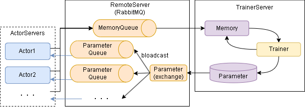

==============================================
Distributed Learning (Multiple PCs)
==============================================

ここではネットワーク経由で学習する方法を説明します。概要は以下です。

.. image:: ../../diagrams/overview-distributed.drawio.png

フローイメージは以下です。

.. image:: ../../diagrams/runner_distributed_flow.png

各サーバとのやりとりですが、RabbitMQを採用しています。RabbitMQ経由でのやりとりイメージは以下です。

学習を実行するまでのステップは以下となります。

0. pikaのインストール(初回のみ)
1. RabbitMQの起動
2. TrainerServer/ActorServerの起動
3. 学習の実施

------------------------
0. pikaのインストール
------------------------

RabbitMQのライブラリとして pika を使うので以下でインストールします。

.. code-block:: console

    $ pip install pika

------------------------
1. RabbitMQの起動
------------------------

| 任意のRabbitMQサーバを用意します。
| フレームワーク上はサンプルとしてdocker-composeファイルを用意していますのでそちらを起動してください。

.. code-block:: console

    $ docker-compose -f examples/rabbitmq/docker-compose.yml up -d

--------------------------------------------
2. TrainerServer/ActorServerの起動
--------------------------------------------

| TrainerServerとActorServerを任意のPCで起動します。
| TrainerServerは1個のみ起動し、ActorServerは1個以上起動します。

TrainerServerの起動例です。(examples/rabbitmq/server_trainer.py)

.. literalinclude:: ../../examples/rabbitmq/server_trainer.py

ActorServerの起動例です。(examples/rabbitmq/server_actor.py)

.. literalinclude:: ../../examples/rabbitmq/server_actor.py

引数は以下です。

.. list-table::
   :widths: 3 2 20
   :header-rows: 0

   * - host
     - str
     - RabbitMQのホスト名またはIPアドレスを指定します。
   * - port
     - int
     - RabbitMQのポートを指定します。省略時は5672を使います。
   * - user
     - str
     - RabbitMQへのログイン名を指定します。省略時はguestを使います。
   * - password
     - str
     - RabbitMQへのログインパスワードを指定します。省略時はguestを使います。

--------------------------------------------
3. 学習の実施
--------------------------------------------

学習のサンプルコードは以下です。Runnerから学習します。

.. literalinclude:: ../../examples/rabbitmq/main.py

