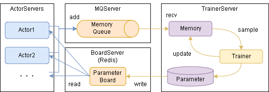

==============================================
Distributed Learning (Online)
==============================================

ここではネットワーク経由で学習する方法を説明します。概要は以下です。

.. image:: ../../diagrams/overview-mp.drawio.png

各サーバとのやりとりのイメージは以下です。

学習を実行するまでのステップは大きく以下となります。

0. 必要なライブラリのインストール(初回のみ)
1. Redisサーバの起動
2. TrainerServer/ActorServerの起動
3. 学習の実施

----------------------------------
0. 必要なライブラリのインストール
----------------------------------

Redis用のライブラリをインストールします。

.. code-block:: console

    $ pip install redis

------------------------------------
1. Redisサーバの起動
------------------------------------

| Redisサーバを用意します。
| サンプルにdocker-composeファイルを用意してるので、そちらの起動でも大丈夫です。
| （DockerComposeが実行できる環境である必要があります）

.. code-block:: console

    $ docker-compose -f examples/distribution/docker-compose.yml up -d

--------------------------------------------
2. TrainerServer/ActorServerの起動
--------------------------------------------

| TrainerServerとActorServerを任意のPCで起動します。
| 基本はTrainerServerは1個、ActorServerは1個以上(actor_num数)の起動を想定しています。
| ※各TrainerServer/ActorServerでも、EnvとAlgorithmが使用できる必要があります

TrainerServerの起動例です。(examples/distribution/server_trainer.py)

.. literalinclude:: ../../examples/distribution/server_trainer.py

ActorServerの起動例です。(examples/distribution/server_actor.py)

.. literalinclude:: ../../examples/distribution/server_actor.py

--------------------------------------------
3. 学習の実施
--------------------------------------------

| 学習のサンプルコードは以下です。Runnerから train_distribution を呼び出すと学習します。
| 学習後はrunner内のparameterに学習済みデータが入っています。

.. literalinclude:: ../../examples/distribution/main_sync.py

| 非同期で学習を実施する場合は以下です。
| 'TaskManager'を使うと直接やりとりできます。

.. literalinclude:: ../../examples/distribution/main_async.py

