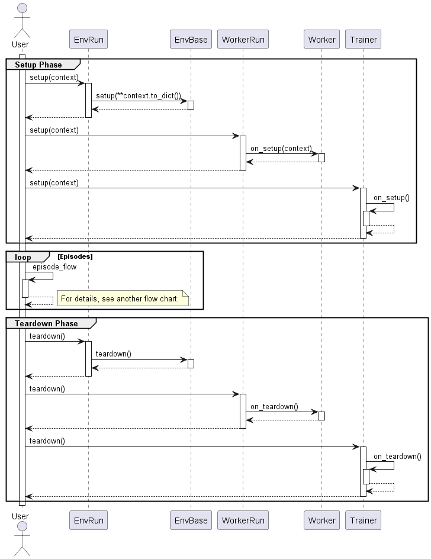

.. _framework_detail:

=====================
Detailed Framework
=====================

Overview
----------------

.. image:: ../../diagrams/overview-sequence.drawio.png

・Multiprocessing flow (Worker-Memory-Trainer)

.. image:: ../../diagrams/overview-mp_memory.drawio.png

・Multiprocessing flow (Worker-Trainer)

.. image:: ../../diagrams/overview-mp.drawio.png

Play flow
----------------

・1 Episode loop

.. image:: ../../diagrams/playflow2.png

Multiplay flow
----------------

.. image:: ../../diagrams/overview-multiplay.drawio.png

Class diagram
----------------

+ RL

.. image:: ../../diagrams/class_rl.png

+ Env

.. image:: ../../diagrams/class_env.png

+ Run

.. image:: ../../diagrams/class_runner.png

Interface Type
----------------

+ SpaceBase(srl.base.spaces)

.. list-table::
   :header-rows: 0

   * - Class
     - Type
     - SpaceType
   * - DiscreteSpace
     - int
     - DISCRETE
   * - ArrayDiscreteSpace
     - list[int]
     - DISCRETE
   * - ContinuousSpace
     - float
     - CONTINUOUS
   * - ArrayContinuousSpace
     - list[float]
     - CONTINUOUS
   * - BoxSpace
     - NDArray[AnyType]
     - srl.base.define.SpaceTypes
   * - TextSpace
     - str
     - DISCRETE
   * - MultiSpace
     - list[SpaceBase]
     - MULTI
   * - AnySpace
     - any
     - UNKNOWN

