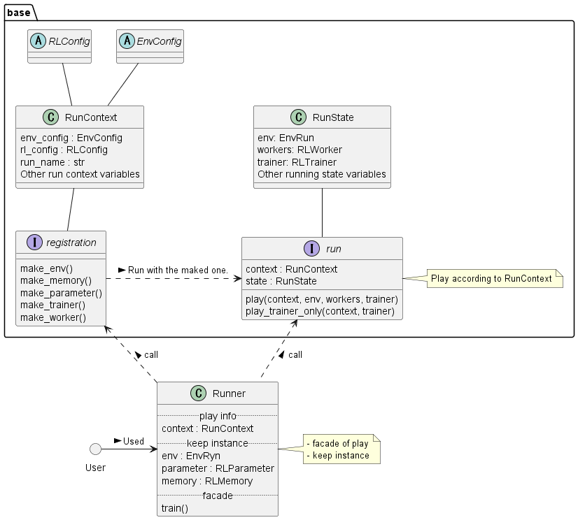

.. _framework_detail:

=====================
Detailed Framework
=====================

Play flow
----------------

.. image:: ../../diagrams/playflow.png

Multiplay flow
----------------

.. image:: ../../diagrams/overview-multiplay.drawio.png

Distributed flow
----------------

.. image:: ../../diagrams/runner_distributed_flow.png

Class diagram
----------------

+ RL

.. image:: ../../diagrams/class_rl.png

+ Env

.. image:: ../../diagrams/class_env.png

+ Run

Interface Type
----------------

+ Env input/output type

.. list-table::
   :widths: 10 10
   :header-rows: 0

   * -  
     - Type
   * - Action
     - Space
   * - Observation
     - Space

+ RL input/output type

.. list-table::
   :widths: 10 10 10
   :header-rows: 0

   * - 
     - 
     - Type
   * - Discrete
     - Action
     - int
   * - Discrete
     - Observation
     - NDArray[int]
   * - Continuous
     - Action
     - list[float]
   * - Continuous
     - Observation
     - NDArray[np.float32]

+ Space(srl.base.env.spaces)

.. list-table::
   :widths: 20 10
   :header-rows: 0

   * - Class
     - Type
   * - DiscreteSpace
     - int
   * - ArrayDiscreteSpace
     - list[int]
   * - ContinuousSpace
     - float
   * - ArrayContinuousSpace
     - list[float]
   * - BoxSpace
     - NDArray[np.float32]
