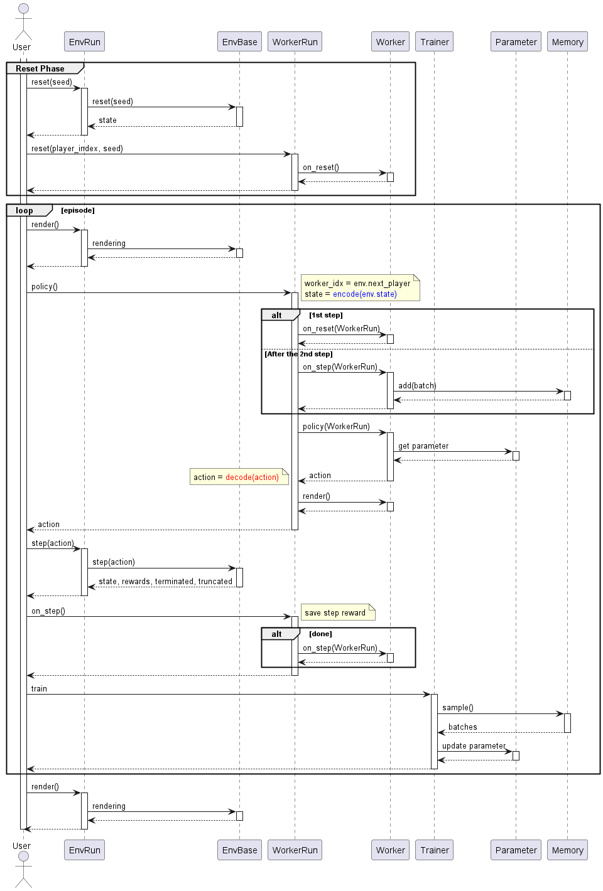

.. _framework_detail:

=====================
Detailed Framework
=====================

Overview
----------------

.. image:: ../../diagrams/overview-sequence.drawio.png

・Multiprocessing flow (Worker-Memory-Trainer)

.. image:: ../../diagrams/overview-mp_memory.drawio.png

・Multiprocessing flow (Worker-Trainer)

.. image:: ../../diagrams/overview-mp.drawio.png

Play flow
----------------

・1 Episode loop

Multiplay flow
----------------

.. image:: ../../diagrams/overview-multiplay.drawio.png

Class diagram
----------------

+ RL

.. image:: ../../diagrams/class_rl.png

+ Env

.. image:: ../../diagrams/class_env.png

+ Run

.. image:: ../../diagrams/class_runner.png

Space(srl.base.spaces)
----------------------------

.. list-table::
   :header-rows: 0

   * - Class
     - Type
     - SpaceType
   * - DiscreteSpace
     - int
     - DISCRETE
   * - ArrayDiscreteSpace
     - list[int]
     - DISCRETE
   * - ContinuousSpace
     - float
     - CONTINUOUS
   * - ArrayContinuousSpace
     - list[float]
     - CONTINUOUS
   * - NpArraySpace
     - NDArray[int] or NDArray[float]  # 1D
     - DISCRETE or CONTINUOUS
   * - BoxSpace
     - NDArray[AnyType]
     - srl.base.define.SpaceTypes
   * - TextSpace
     - str
     - DISCRETE
   * - MultiSpace
     - list[SpaceBase]
     - MULTI
   * - AnySpace
     - any
     - UNKNOWN

.. _RLBaseTypes:

RLBaseTypes(srl.base.define)
--------------------------------

.. list-table::
   :header-rows: 0

   * - Name
     - Type
     - Space
     - Note
   * - NONE
     - 
     - copy
     - No Change
   * - DISCRETE
     - int
     - DiscreteSpace
     - 
   * - ARRAY_DISCRETE
     - list[int]
     - ArrayDiscreteSpace
     - 
   * - CONTINUOUS
     - float
     - ContinuousSpace
     - 
   * - ARRAY_CONTINUOUS
     - list[float]
     - ArrayContinuousSpace
     - 
   * - NP_ARRAY
     - NDArray[float]
     - ArrayNpSpace
     - float固定（configで変更可能）
   * - NP_ARRAY_UNTYPED
     - NDArray[int] or NDArray[float]
     - ArrayNpSpace
     - dtype変換なし
   * - BOX
     - NDArray[float]
     - BoxSpace
     - float固定（configで変更可能）
   * - BOX_UNTYPED
     - NDArray[Any]
     - BoxSpace
     - dtype変換なし
   * - TEXT
     - str
     - TextSpace
     - 
   * - MULTI
     - list
     - MultiSpace
     - 

